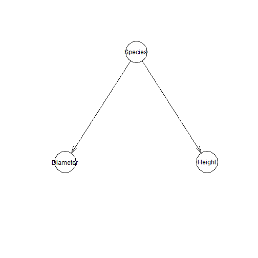
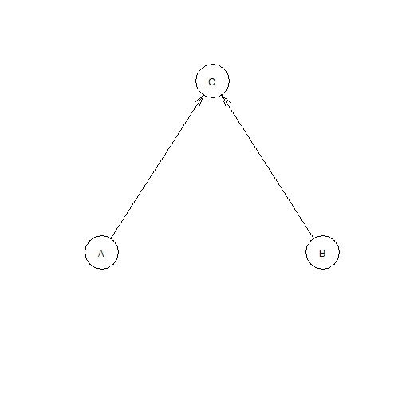

Bayesian Network_Presentation_Notes
========================================================
author: Kirsten Dorans
date: July 20, 2017
autosize: true
css: oss.css

Bayesian Decision Network Definition
========================================================

- This is an ugly presentation with some info I have learned about Bayesian Decision Networks
- Probabilistic graphical model (a type of statistical model) 
- Represents a set of random variables and their conditional dependencies via a directed acyclic graph


Key Benefits of Bayesian Decision Network
========================================================

From <https://www.r-bloggers.com/bayesian-network-in-r-introduction/>
- It is easy to exploit expert knowledge in BN models. 
- BN models have been found to be very robust in the sense of i) noisy data, ii) missing data and iii) sparse data. 
- Unlike many machine learning models (including Artificial Neural Network), which usually appear as a “black box,” all the parameters in BNs have an understandable semantic interpretation. 
          
          
Creating Custom Fitted Bayesian Networks
========================================================

- Think we are using hybrid approach (expert-driven for structure and data driven for parameters)

From <http://www.bnlearn.com/examples/custom/>

3 main approaches:
- Data-driven approach, learning it from a data set using bn.fit() and a network structure (in a bn object) as illustrated here;
- An expert-driven approach, in which both the network structure and the parameters are specified by the user;
- A hybrid approach combining the above.


Example: Lizards
========================================================


```r
library(bnlearn)
# load data
data(lizards)

# create the network structure.
dag = model2network("[Species][Diameter|Species][Height|Species]")
```

Lizard Network
========================================================




Option 1. Using 'Long Data' Format
========================================================


```
  Species Diameter Height
1  Sagrei   narrow    low
2  Sagrei   narrow    low
3  Sagrei   narrow    low
4  Sagrei   narrow    low
5  Sagrei   narrow    low
6  Sagrei   narrow    low
```
 
Option 1. Use bn.fit to Estimate Conditional Probabilities 
========================================================

```r
# EM Algorithm
fittedbn1 <- bn.fit(dag, data=lizards)
print(fittedbn1$Height)
```

```

  Parameters of node Height (multinomial distribution)

Conditional probability table:
 
      Species
Height    Sagrei Distichus
  high 0.7378049 0.5836735
  low  0.2621951 0.4163265
```

Inference on Option 1
========================================================

```r
# Need to set.seed to get same answer each time
set.seed(1) 

# What is probability of low height given species=Sagrei?
cpquery(fittedbn1, event = (Height=="low"), evidence= (Species=="Sagrei"))
```

```
[1] 0.2675192
```

```r
# This example is very simple and can directly look up probability from table
```

Option 2. 'Manually' Calculate and Assign Conditional Probabilities
========================================================

```r
# Another dummy example (not lizards) included here

cptA = matrix(c(0.4, 0.6), ncol = 2, dimnames = list(NULL, c("LOW", "HIGH")))
cptB = matrix(c(0.8, 0.2), ncol = 2, dimnames = list(NULL, c("GOOD", "BAD")))
cptB
```

```
     GOOD BAD
[1,]  0.8 0.2
```


Option 2. 'Manually' Calculate and Assign Conditional Probabilities
========================================================

```r
cptC = c(0.5, 0.5, 0.4, 0.6, 0.3, 0.7, 0.2, 0.8)
dim(cptC) = c(2,2,2) 
dimnames(cptC) = list("C" = c("TRUE", "FALSE"), "A" =  c("LOW", "HIGH"), "B" = c("GOOD", "BAD"))
cptC
```

```
, , B = GOOD

       A
C       LOW HIGH
  TRUE  0.5  0.4
  FALSE 0.5  0.6

, , B = BAD

       A
C       LOW HIGH
  TRUE  0.3  0.2
  FALSE 0.7  0.8
```


Option 2. 'Manually' Calculate and Assign Conditional Probabilities
========================================================

```r
net = model2network("[A][B][C|A:B]")
dfit = custom.fit(net, dist = list(A = cptA, B = cptB, C = cptC))
dfit
```

```

  Bayesian network parameters

  Parameters of node A (multinomial distribution)

Conditional probability table:
 
 LOW HIGH 
 0.4  0.6 

  Parameters of node B (multinomial distribution)

Conditional probability table:
 
GOOD  BAD 
 0.8  0.2 

  Parameters of node C (multinomial distribution)

Conditional probability table:
 
, , B = GOOD

       A
C       LOW HIGH
  TRUE  0.5  0.4
  FALSE 0.5  0.6

, , B = BAD

       A
C       LOW HIGH
  TRUE  0.3  0.2
  FALSE 0.7  0.8
```


Option 2. 'Manually' Calculate and Assign Conditional Probabilities
========================================================



Inference on Option 2
========================================================

```r
set.seed(1) 
cpquery(dfit, event = (C=="TRUE"), evidence= (A=="LOW"))
```

```
[1] 0.4548611
```


  

