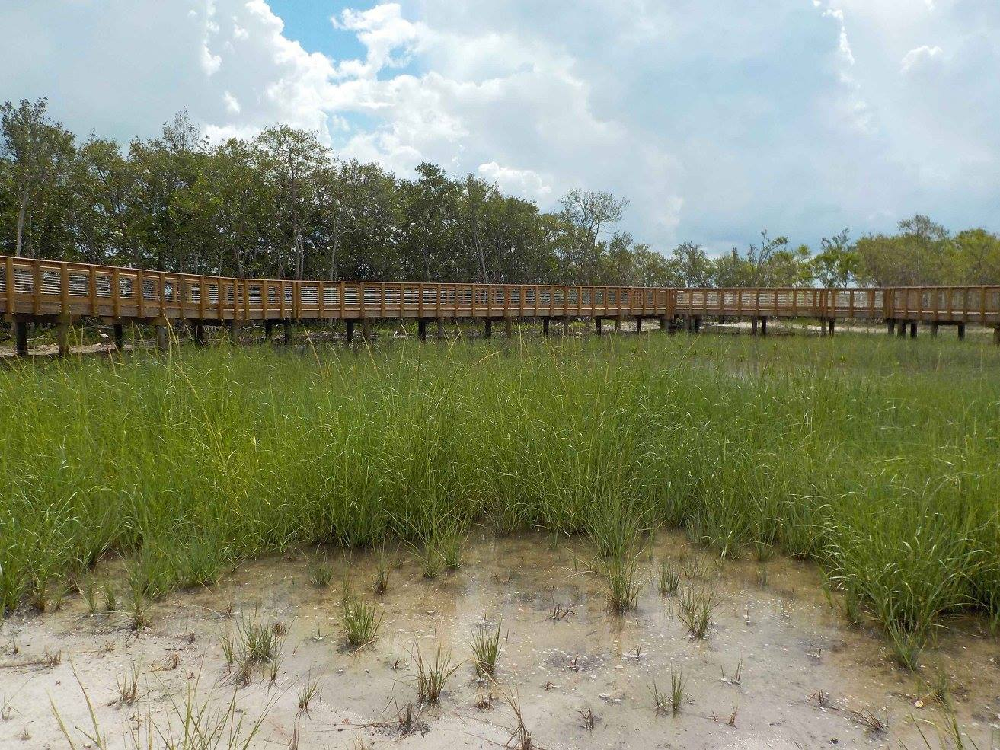
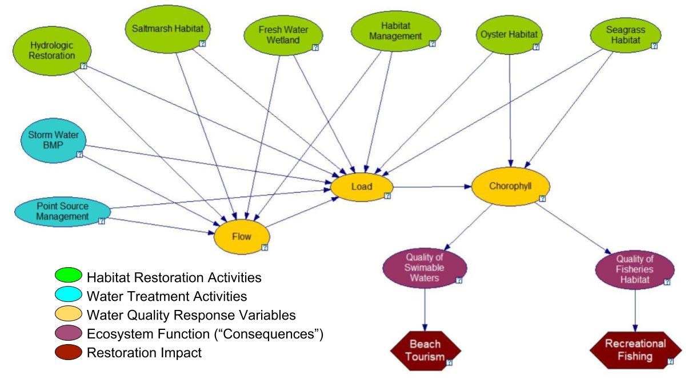
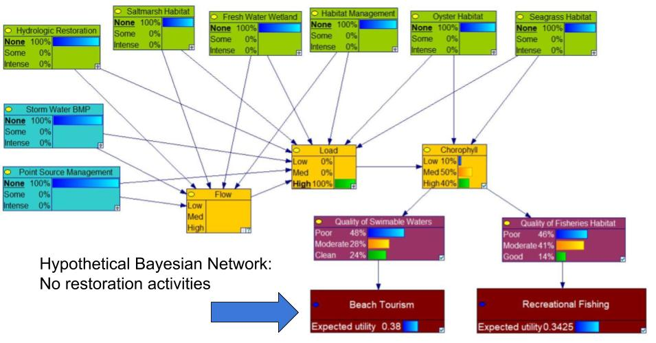
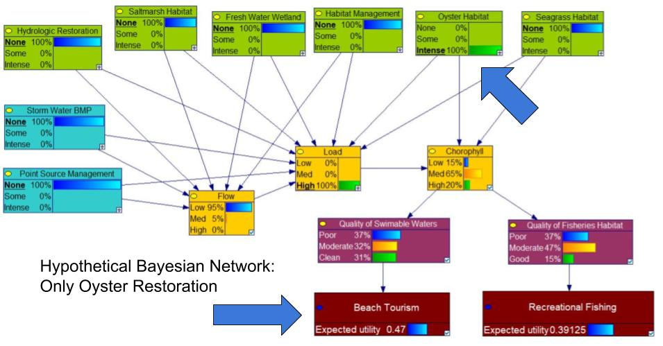
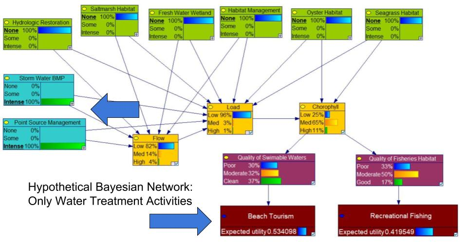
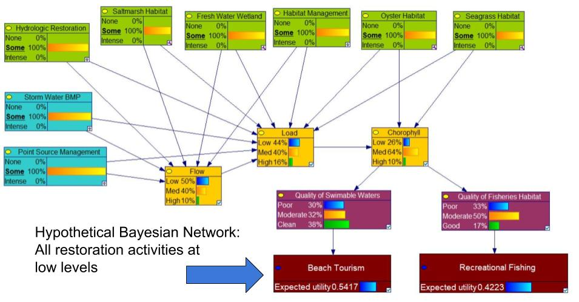
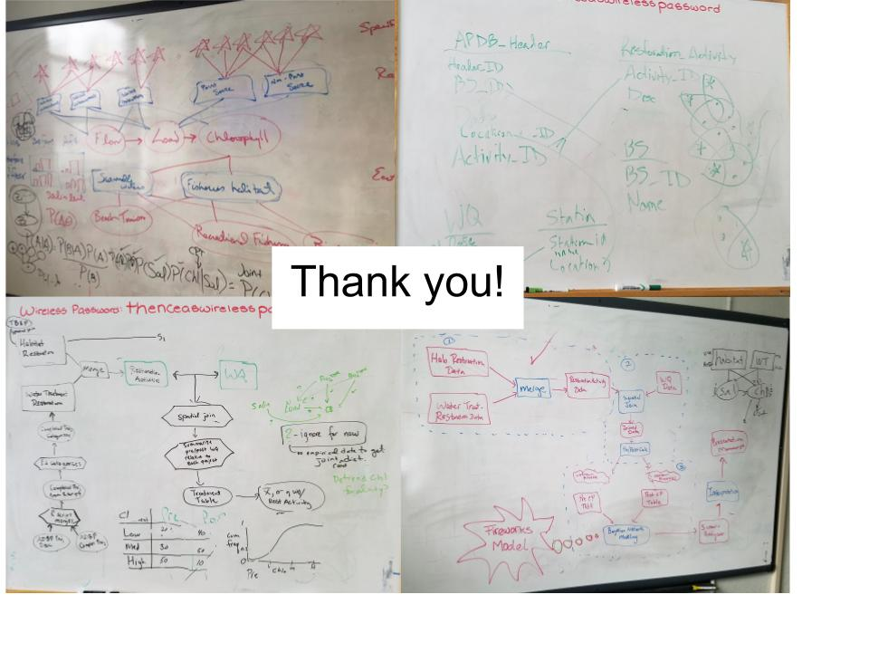

Jessica_section
========================================================
author: Jessica
date: 2017_07_26
autosize: true

Deepwater Horizon Settlement Agreement
========================================================

Over $10B in Restoration Activities
========================================================
 
Graphic: eli-ocean.org

Cumulative Effects of Restoration Activities?
========================================================
Despite considerable investments in aquatic ecosystem restoration consistent and comprehensive effectiveness evaluation continues to elude practitioners at geographic scales. (Diefenderfer et al. 2016)

Cumulative Effects of Restoration Activities?
========================================================

Unique Problems --> Unique Solutions
========================================================

Bayesian Networks to support Decision-Making
========================================================
* Graphical modeling method based on influence diagrams.

* Represents the cause and effect dependencies of a process.

* Used for decision making and artificial intelligence. [Korb and Nicholson, 2004]

Tampa Bay was gross
========================================================

***

Tampa Bay is a lot better now
========================================================

***

But how much less gross??
========================================================

Cumulative Effects of Restoration Activities?
========================================================

Short-tem Goals
=============
*  Apply a bayesian decision network as a support tool that incorporates:
    * Expert knowledge of restoration activities
    * Empirical observations
    * Theoretical framework 
* Test hypotheses about the effects of different types of restoration activities on water quality in Tampa Bay

Long-term Goals
=============
* Develop a general and flexible framework that can be applied to unique locations and is not limited by data availability
* Explicit quantification of uncertainty and model updates with new data
* More focused restoration towards specific regional issues
* Improved ability to predict outcomes of proposed restoration projects

#The slides below are for the end of the presentation

Guiding Restoration Decision Making?
========================================================

Guiding Restoration Decision Making?
========================================================

Guiding Restoration Decision Making?
========================================================

Guiding Restoration Decision Making?
========================================================

Guiding Restoration Decision Making?
========================================================

Lessons Learned and Next Steps:
========================================================
rPres is for masochists

Low-tech Data Synthesis
========================================================

