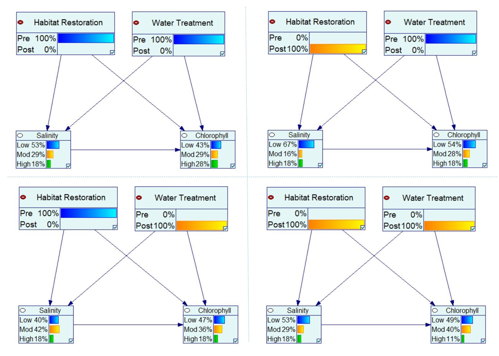

Pres_PV
========================================================
author: Patricia Varela
date: 
autosize: true

Bayesian Networks
========================================================

* Graphical modeling method based on influence diagrams.
* Represents the cause and effect dependencies of a process.
* Nodes are probability distributions and connectors are dependencies.
* Used for decision making and artificial intelligence. 

$$P\left(H \mid E\right) = \frac{P\left(E \mid H\right) \cdot P\left(H \right)}{P \left(E\right)}$$

***
<div align="center">

</div>

Bayesian Networks
========================================================

<div align="center">

</div>

```{}
library(bnlearn)
net = model2network("[X1][X2][Xn][X_Child|X1:X2:Xn]")
```

***
<div align="center">

</div>


Training Conditional Probability Tables
========================================================

<div align="center">

</div>

Results Small Model
========================================================
<div align="center">

</div>


Results Small Model
========================================================

Salinity
<div align="center">

</div>

***

Chlorophyll
<div align="center">

</div>
