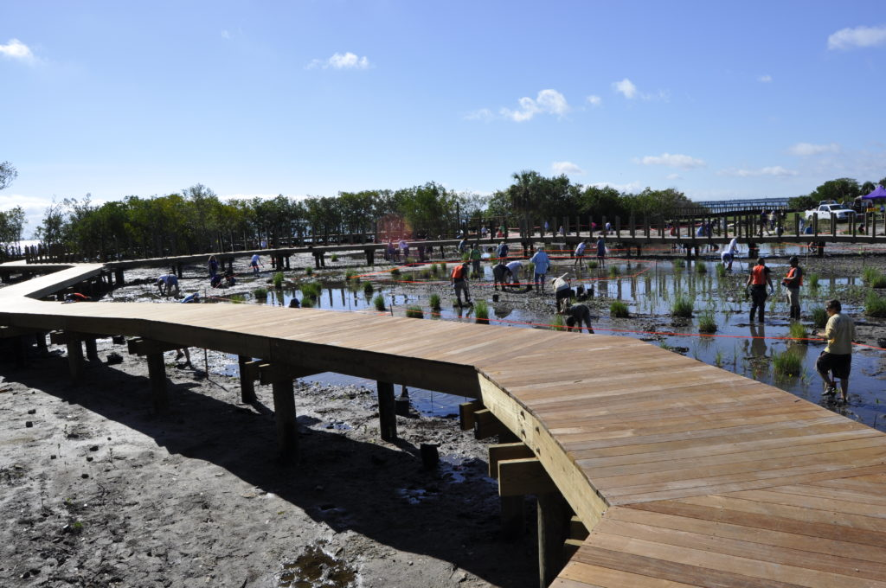
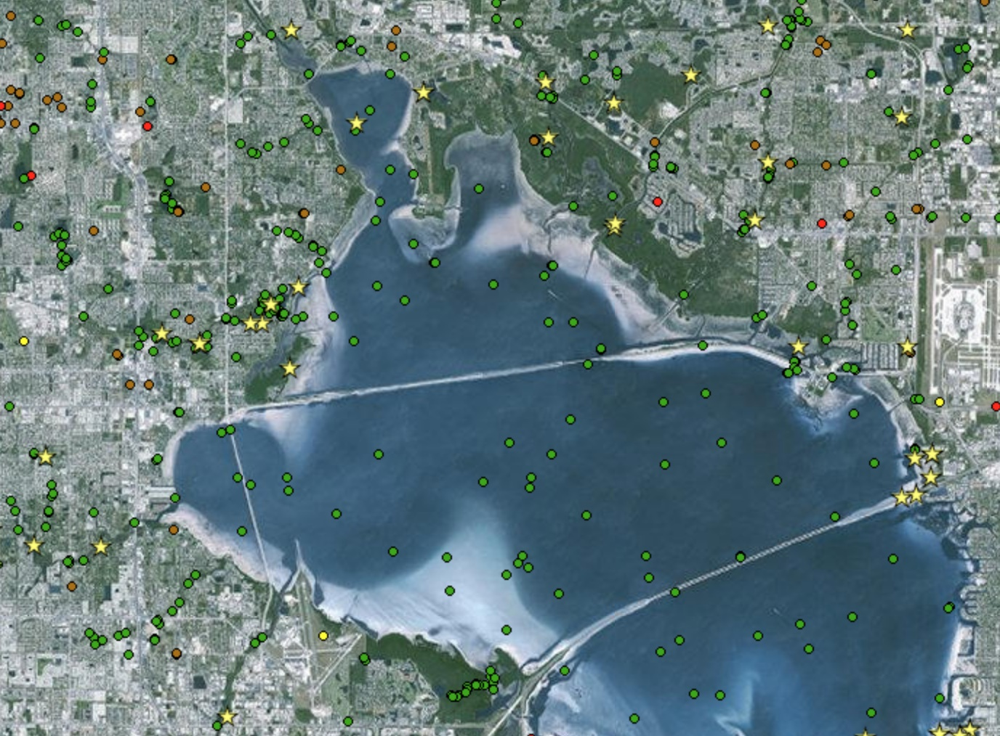

<insertHTML:[columns.html]

Use of prior knowledge to inform restoration projects in estuaries of GOM
========================================================
author: Kirsten Dorans, Patricia Varela, Kathryn Ireland, Marcus Beck, Ed Sherwood, Jessica Renee Henkel
date: July 28, 2017
autosize: true
css: oss.css
  
Deepwater Horizon Settlement Agreement
========================================================


Over $10B in Potential Restoration Activities
========================================================


Cumulative Effects of Restoration Activities?
========================================================


* Vision to make it portable
* Why Bayesian networks

Benefits
=============

* A general and flexible framework that can be applied to unique locations and is not limited by data availability
* Explicit quantification of uncertainty and model updates with new data
* More focused restoration towards specific regional issues
* Improved ability to predict outcomes of proposed restoration projects

Tampa Bay was gross
========================================================


Tampa Bay is not as gross
========================================================


Tampa Bay is not as gross
========================================================


But how much less gross??
========================================================


But how much less gross??
========================================================

Ed 
* Tampa Bay Background

Tampa Bay Data Sources
========================================================
incremental: false

<div align="center">

</div>

***
* Rich WQ Monitoring Datatset (1974-Present)
* Info on a Variety of Different Restoration Activities
      * Habitat Establishment
      * Habitat Enhancement
      * Habitat Protection
      * Stormwater Controls
      * Point Source Controls

Workflow
========================================================
Kirsten/Katie
* Model diagram
* Merging restoration diagram

Data plyring
========================================================
incremental: true

* Can we identify a change in water quality from restoration?
* What data do we have?
* Can we *plyr* the data to identify a signal?
* Can we *plyr* the data as input to a BN?

Data plyring
========================================================
incremental: true

Water quality data: 40 years, monthly, 45 stations


Data plyring
========================================================

Water quality data: 40 years, monthly, 45 stations


```
Error in eval(expr, envir, enclos) : object 'pbase' not found
```
