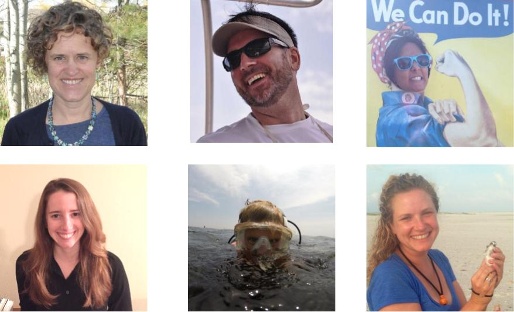
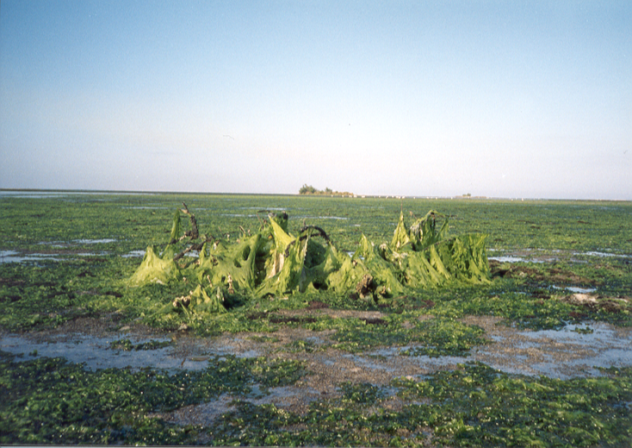
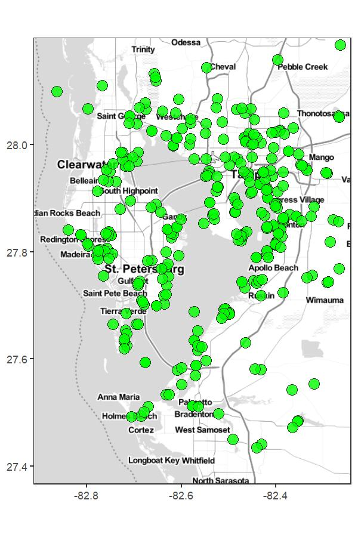
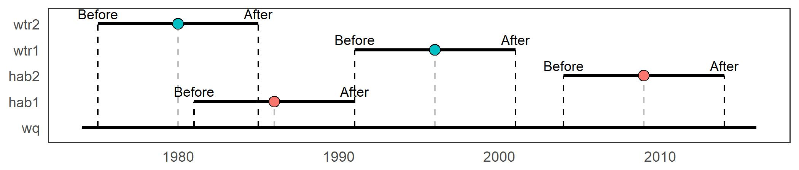
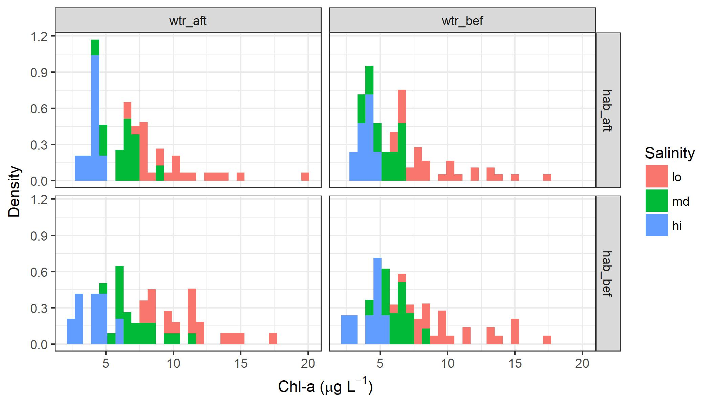
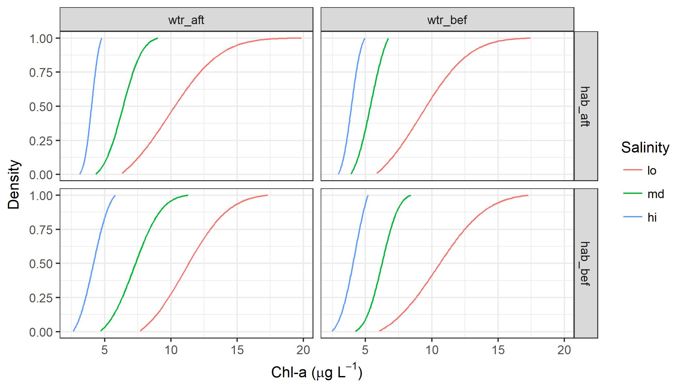

<insertHTML:[columns.html]

Use of prior knowledge to inform restoration projects in estuaries of GOM
========================================================
date: July 28, 2017
autosize: true
css: oss.css
transition: none


```r
# randomize author order
aut <- c('Marcus Beck', 'Kirsten Dorans', 'Jessica Renee Henkel', 'Kathryn Ireland', 'Ed Sherwood', 'Patricia Varela') %>% 
  sample %>% 
  paste(collapse = ', ')
```
By Kirsten Dorans, Jessica Renee Henkel, Patricia Varela, Ed Sherwood, Marcus Beck, Kathryn Ireland

Deepwater Horizon Settlement Agreement
========================================================


$10B in Potential Restoration Activities
========================================================
<div class="img-with-text" align="center">
    
    <p><font size = "3">Graphic: eli-ocean.org</font></p>
</div>

Cumulative Effects of Restoration Activities?
========================================================
* Despite considerable **investments** in aquatic ecosystem restoration, consistent and comprehensive **effectiveness evaluation** continues to elude practitioners at geographic scales. (Diefenderfer et al. 2016)


Unique Problems -> Unique Solutions
========================================================


Bayesian Networks
========================================================

* Graphical modeling method based on influence diagrams.
* Represents the cause and effect dependencies of a process.
* Used to inform decision-making (Korb and Nicholson, 2004)

$$P\left(H \mid E\right) = \frac{P\left(E \mid H\right) \cdot P\left(H \right)}{P \left(E\right)}$$

***
<div align="center">

</div>

Tampa Bay - from bad to good
========================================================


***


Cumulative Effects of Restoration Activities?
========================================================
<p> </p>


Project goals
========================================================
incremental: true

<div align="center" class="vspace"><b><i>
Can we use disparate data to prioritize future restoration projects aimed at improving water quality?
</i></b></div>
<p> </p>

* **Synthesize** data in space and time to evaluate cumulative effects of restoration projects

* **Develop** a Bayesian Decision Network with empirical observations to evaluate likelihood of potential outcomes

* **Expand** to other estuaries using a flexible framework

Overall Workflow
========================================================


WQ Monitoring in Tampa Bay
========================================================
incremental: false
<div align="center">

</div>

***
* Rich WQ Monitoring Datatset (1974-)
* Time series, monthly step - ~500 obs. per site
* Available as an EXCEL spreadsheet <ftp://ftp.epchc.org>

TB Restoration Sites: Various Sources 
===============
incremental: false

* **"Softer" Restoration** -> Local ordinances (e.g. ferilizer restrictions), Education, etc.
* **"Soft" Restoration** -> Habitat Creation, Enhancement and Management/Protection Measures
* **"Hard" Restoration** -> Stormwater BMPs, Point Source Reductions through Time, Regulations

TB Restoration Site Info: First Source
===============
incremental: false

<div align="center">

</div>

***
* Tracking "traditional" restoration sites since ~1970s
* Include habitat creation, enhancement and acquisitions
* <http://maps.wateratlas.usf.edu/tampabay/>

TB Restoration Site Info: Second Source
===============
incremental: false

<div astyle="position: relative;">

  <span id="overlay_img"></span>
</div>

***
* Tracking infrastructure improvements since ~1990s
* Include habitat creation, enhancement and acquisitions
* <http://apdb.tbeptech.org>

Overall Workflow
========================================================


Developing Restoration Dataset
========================================================
* Water Treatment Projects
  * Two Raw Datasets: <http://apdb.tbeptech.org>
  * Descriptions, names, location
  * dplyr:  combine dataset (*left_join*), subset (*filter*) to subbasins of interest, find WT projects not listed as complete for further investigation (*anti-join*)


```
# A tibble: 5 x 19
  HeaderID                             Project_Name      Bay_Segment
     <int>                                    <chr>            <chr>
1        8 Delany Creek Wetland Restoration Project Hillsborough Bay
2       10           Cone Ranch Restoration Project Hillsborough Bay
3       11   29th or 30th Street Outfall/ Mckay Bay Hillsborough Bay
4       14          Palma Ceia Area Stormwater Pond Hillsborough Bay
5       15            North Tampa Pond Enlargements Hillsborough Bay
# ... with 16 more variables: Lead_Entity <chr>, Completion_Date <int>,
#   TP_Reduction_lbs_yr <dbl>, TN_Reduction_lbs_yr <dbl>,
#   TSS_Reduction_lbs_yr <int>, ProjectName <chr>,
#   OngoingInitiation <int>, DiscontinuedDate <int>, CompletionDate <int>,
#   ActualProjectCost <chr>, FundingSource <chr>,
#   ProjectDescriptionText <chr>, NonPointProject <int>,
#   PointProject <int>, ProjectLatitude <dbl>, ProjectLongitude <dbl>
```

Developing Restoration Dataset
========================================================
* Water Treatment Projects
  * Manual categorization of WT projects by technique = Categorized WT Projects

  * Broad classification: 5 unique WT project activities

```
[1] "Nonpoint_Source"       "Habitat_Enhancement"   "Habitat_Establishment"
[4] "Habitat_Protection"    "Point_Source"         
```

Developing Restoration Dataset
========================================================
* Water Treatment Projects
  * Finer classification: 26 unique WT project technologies

```
 [1] "BMP_Wetland_Treatment"  "Hydrologic_Restoration"
 [3] "BMP_Baffle_Box"         "BMP_Stormwater_Pond"   
 [5] "FW_Wetlands"            "BMP_Management"        
 [7] "Acquisition"            "BMP_On_Site"           
 [9] "PS_Treatment"           "Mangroves"             
[11] "Send_to_WWTP"           "BMP_Alum_Treatment"    
[13] "BMP_Treatment_Train"    "Uplands"               
[15] "Dredging"               "Education"             
[17] "Increase_Reuse"         "Management"            
[19] "Atmospheric_Deposition" "Protection_Management" 
[21] "Regulation"             "Exotic_Control"        
[23] "Saltmarsh"              "BMP_CDS_Unit"          
[25] "BMP_Agricultural"       "Street_Sweeping"       
```

Developing Restoration Dataset
========================================================
* Habitat Restoration Projects
  * Raw dataset: <http://http://maps.wateratlas.usf.edu/tampabay/>
  * Manual categorization of Habitat Restoration projects by technique = Categorized Habitation Restoration Projects
  * Broad classification: 3 unique WT project activities

```
[1] "Habitat_Enhancement"   "Habitat_Establishment" "Habitat_Protection"   
```

Developing Restoration Dataset
========================================================
* Habitat Restoration Projects
  * Finer classification: 9 unique habitat restoration technologies

```
[1] "Hydrologic_Restoration" "Exotic_Control"        
[3] "FW_Wetlands"            "Mangroves"             
[5] "Saltmarsh"              "Protection_Management" 
[7] "Seagrass_Habitat"       "Oyster_Habitat"        
[9] "Acquisition"           
```

Combined Restoration Data
==============

<div astyle="position: relative;">

</div>

***
* Restoration sites in Tampa Bay, watershed
      * Habitat Establishment
      * Habitat Enhancement
      * Habitat Protection
      * Stormwater Controls
      * Point Source Controls
* 571 projects, 1971 - 2016

Cumulative Effects of Restoration Activities?
========================================================
<p> </p>


Cumulative Effects of Restoration Activities?
========================================================
A simple model (aka minimum viable product)


Overall Workflow
========================================================


Data plyring
========================================================
incremental: true

<div align="center">

<div align="center">

* Can we identify a change in water quality from restoration?
* Can we plyr the data as input to a BN?

Data plyring
========================================================
incremental: false


WQ and restoration sites
<div align="center">

</div>

***

* Can we identify a change in water quality from restoration?
* Can we plyr the data as input to a BN?

Data plyring
========================================================
incremental: false

WQ and restoration sites
<div align="center">

</div>

***

* Can we identify a change in water quality from restoration?
* Can we plyr the data as input to a BN?
* Consider an effect of restoration **site type**?

Data plyring
========================================================
incremental: false

WQ and restoration sites
<div align="center">

</div>

***

* Can we identify a change in water quality from restoration?
* Can we plyr the data as input to a BN?
* Consider an effect of restoration **site type**?
* Consider **distance** of sites from water quality stations?

Data plyring
========================================================
incremental: false

WQ and restoration sites
<div align="center">

</div>

***

* Can we identify a change in water quality from restoration?
* Can we plyr the data as input to a BN?
* Consider an effect of restoration **site type**?
* Consider **distance** of sites from water quality stations?
* Consider a **cumulative effect**?

Data plyring
========================================================


WQ and restoration sites: **Spatial match**

<div align="center">

</div>

Data plyring
========================================================

WQ and restoration sites: **Spatial match**
<div align="center">

</div>

WQ and restoration sites: **Temporal match**
<div align="center">

</div>

Data plyring
========================================================

WQ and restoration sites: **Spatial match**
<div align="center">

</div>

WQ and restoration sites: **Temporal match**, **before/after**
<div align="center">

</div>

Data plyring
========================================================

WQ and restoration sites: **Spatial match**
<div align="center">

</div>

WQ and restoration sites: **Temporal match**, **before/after**, **slice**
<div align="center">

</div>

Data plyring
========================================================

What do the data look like? For **one** water quality station matched to **many**
restoration sites...

WQ and restoration sites: **Temporal match**, **before/after**, **slice**
<div align="center">

</div>


```
# A tibble: 4 x 3
# Groups:   stat [1]
   stat     cmb     cval
  <int>   <chr>    <dbl>
1     7 hab_aft 8.255185
2     7 hab_bef 8.350187
3     7 wtr_aft 8.053273
4     7 wtr_bef 8.129733
```

Data plyring
========================================================

What do the data look like? For **many** water quality stations matched to **many**
restoration sites...

```
# A tibble: 20 x 4
    stat     hab     wtr      cval
   <int>  <fctr>  <fctr>     <dbl>
 1     6 hab_aft wtr_aft  8.903273
 2     6 hab_aft wtr_bef 11.720206
 3     6 hab_bef wtr_aft 11.902951
 4     6 hab_bef wtr_bef 14.719883
 5     7 hab_aft wtr_aft  8.154229
 6     7 hab_aft wtr_bef  8.192459
 7     7 hab_bef wtr_aft  8.201730
 8     7 hab_bef wtr_bef  8.239960
 9     8 hab_aft wtr_aft 19.867100
10     8 hab_aft wtr_bef 17.444274
11     8 hab_bef wtr_aft 17.331973
12     8 hab_bef wtr_bef 14.909147
13     9 hab_aft wtr_aft  9.030021
14     9 hab_aft wtr_bef  8.621069
15     9 hab_bef wtr_aft  8.398558
16     9 hab_bef wtr_bef  7.989606
17    11 hab_aft wtr_aft  6.576058
18    11 hab_aft wtr_bef  6.727664
19    11 hab_bef wtr_aft  8.112902
20    11 hab_bef wtr_bef  8.264508
```

Data plyring
========================================================


What do the data look like? For **many** water quality stations matched to **many**
restoration sites...
<div align="center">

</div>

Data plyring
========================================================

What do the data look like? For **many** water quality stations matched to **many**
restoration sites...
<div align="center">

</div>

Data plyring
========================================================

What do the data look like? For **many** water quality stations matched to **many**
restoration sites...
<div align="center">

</div>

Data plyring
========================================================
incremental: true

* In other words, what is the **conditional distribution** of chlorophyll given **restoration type** and **before/after** effect?

* Similar to a **two-way** ANOVA...

$$ Chl \sim\ f\left(Water \space\ treatment \times Habitat \space\ restoration\right)$$

* This can be extrapolated to additional 'treatments', or a **three-way** ANOVA

$$ Chl \sim\ f\left(Water \space\ treatment \times Habitat \space\ restoration \times Salinity \right)$$

Data plyring
========================================================
Conditional distributions on **two-levels**:

<div align="center">

</div>

Data plyring
========================================================


Conditional distributions on **three-levels**:

<div align="center">

</div>

Data plyring
========================================================

Conditional distributions on **three-levels**:

<div align="center">

</div>

Data plyring
========================================================

Conditional distributions on **three-levels**:

<div align="center">

</div>

Overall Workflow
========================================================


Bayesian Network
========================================================
incremental: true

* **Water quality** (chlorophyll) responds to **restoration** with varying effects by **salinity**

* In the **frequentist** framework - mean chlorophyll varies given treatment

$$ Chl \sim\ f\left(Water \space\ treatment \times Habitat \space\ restoration \times Salinity \right)$$

* In the **Bayesian** framework - probability of an event depends on occurrence of other events

$$ P\left(Chl \mid Event\right) = \frac{P\left(Event \mid Chl\right) \cdot P\left(Chl \right)}{P \left(Event\right)}$$

Bayesian Network
========================================================
incremental: true

What is the probability of low/medium/high chlorophyll given other events?

* Do water quality conditions differ by **restoration type**?
* Does it differ by **salinity** as a natural covariate?
* Is the change in agreement with expectation?

BN lets us evaluate likelihood of **potential outcomes** given **conditional distributions**

Bayesian Network
========================================================
<div align="center">

</div>

Bayesian Network
========================================================


Results Small Model
========================================================


Results Small Model
========================================================


Results Small Model
========================================================


Results Small Model
========================================================


Results Small Model
========================================================


Overall Workflow
========================================================


Guiding Restoration Decision Making?
========================================================


Guiding Restoration Decision Making?
========================================================


Guiding Restoration Decision Making?
========================================================


Guiding Restoration Decision Making?
========================================================


Guiding Restoration Decision Making?
========================================================


Guiding Restoration Decision Making?
========================================================


Lessons Learned
========================================================


<div align="center">

</div>
***
<div align="center">

</div>

Low-tech Data Synthesis
========================================================


Supplemental
========================================================

GitHub: [https://github.com/fawda123/oss2017_synthesis](https://github.com/fawda123/oss2017_synthesis)

Extra slides: [final_pres_supp](https://fawda123.github.io/oss2017_synthesis/presentations/final_pres_supp)

Shiny: [http://tbeptech.org:3939/content/5/](http://tbeptech.org:3939/content/5/)

Jiggly plot: [bayes_network](https://fawda123.github.io/oss2017_synthesis/presentations/final_pres-figure/bayes_network.html)
