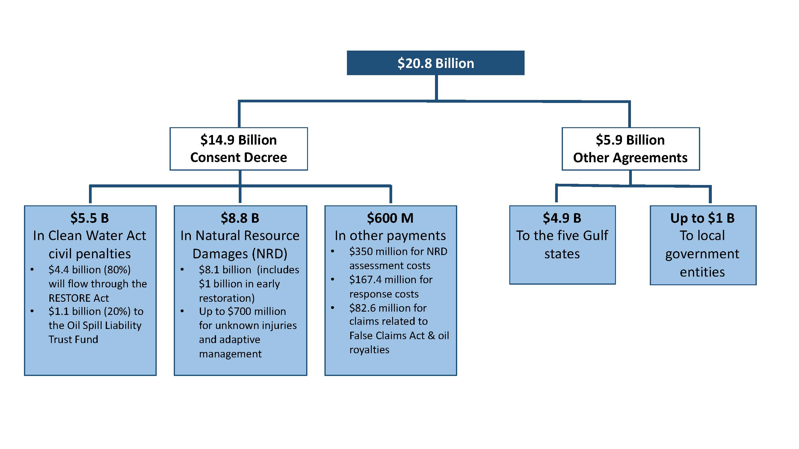
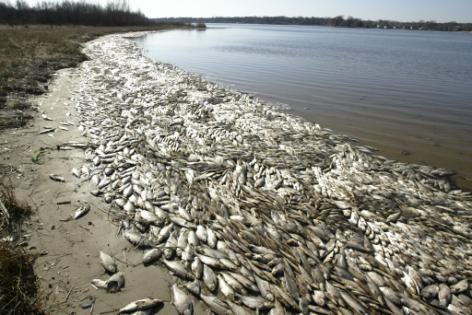
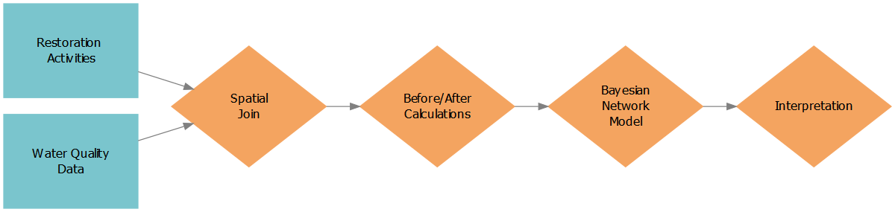
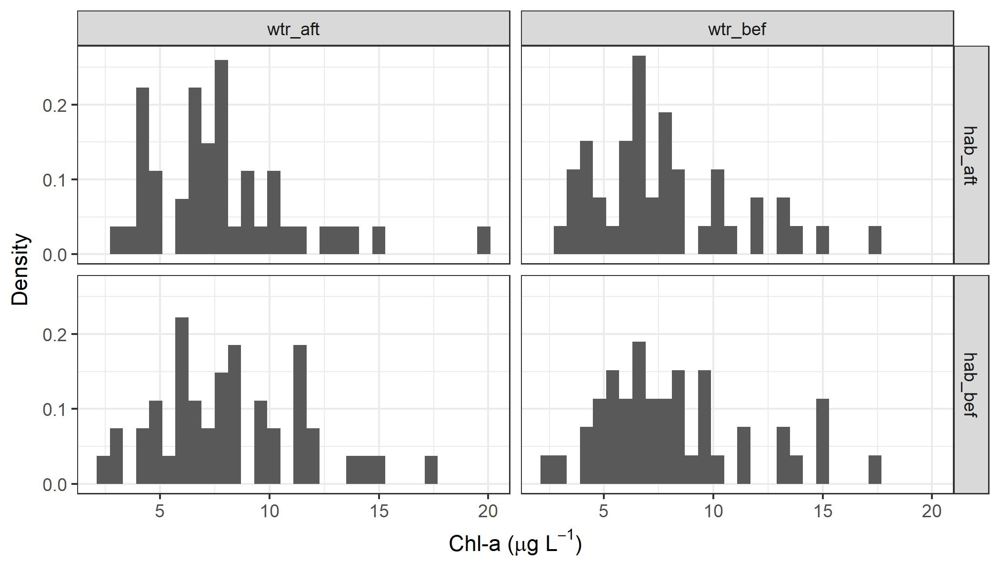
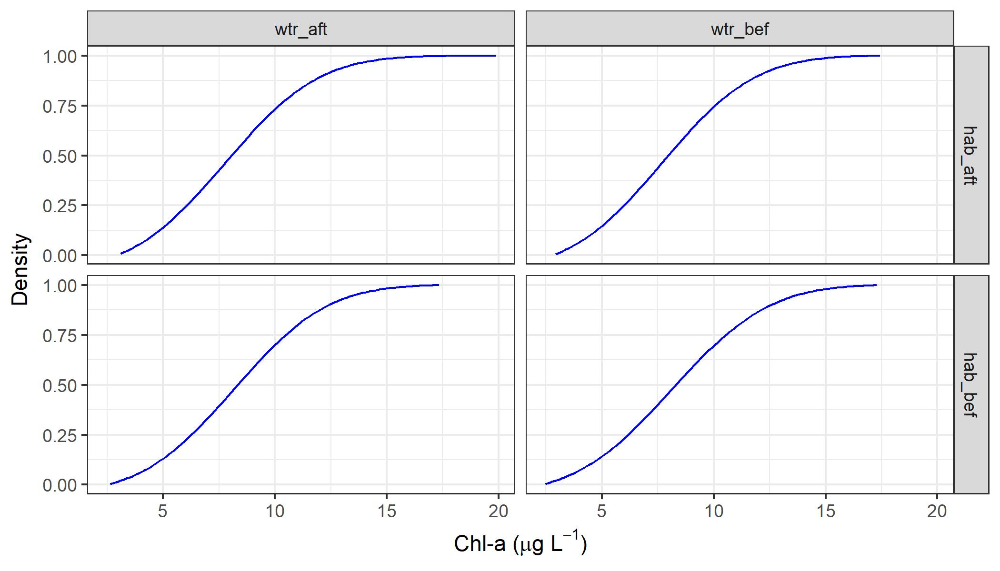

<insertHTML:[columns.html]

Use of prior knowledge to inform restoration projects in estuaries of GOM
========================================================
date: July 28, 2017
autosize: true
css: oss.css


```r
# randomize author order
aut <- c('Marcus Beck', 'Kirsten Dorans', 'Jessica Renee Henkel', 'Kathryn Ireland', 'Ed Sherwood', 'Patricia Varela') %>% 
  sample %>% 
  paste(collapse = ', ')

cat('By', aut)
```

```
By Kathryn Ireland, Ed Sherwood, Marcus Beck, Jessica Renee Henkel, Patricia Varela, Kirsten Dorans
```
  
Deepwater Horizon Settlement Agreement
========================================================


Over $10B in Potential Restoration Activities
========================================================

Graphic: eli-ocean.org

Cumulative Effects of Restoration Activities?
========================================================
*Despite considerable investments in aquatic ecosystem restoration consistent and comprehensive effectiveness evaluation continues to elude practitioners at geographic scales. (Diefenderfer et al. 2016)


Cumulative Effects of Restoration Activities?
========================================================


* Vision to make it portable
* Why Bayesian networks

Cumulative Effects of Restoration Activities?
========================================================


* Vision to make it portable
* Why Bayesian networks
Benefits
=============

* A general and flexible framework that can be applied to unique locations and is not limited by data availability
* Explicit quantification of uncertainty and model updates with new data
* More focused restoration towards specific regional issues
* Improved ability to predict outcomes of proposed restoration projects


A Network
========================================================
* <https://fawda123.github.io/oss2017_synthesis/presentations/final_pres-figure/bayes_network.html>


Tampa Bay was gross
========================================================
<div align="center">
<div align="left">

</div>
***

<div align="right">

</div>
</div>

Tampa Bay is a lot better now
========================================================
<div align="center">
<div align="left">

</div>
***

<div align="right">

</div>
</div>

But how much less gross??
========================================================


Water Quality Monitoring in Tampa Bay 
========================================================
incremental: false
<div align="center">

</div>

***
* Rich WQ Monitoring Datatset (1974-)
      * 45 Stations in TB
      * Chlorophyll, salinity, dissolved oxygen, etc.
      * Depth-integrated
      * QAQC
* Time series, monthly step - ~500 obs. per site
* Available as an EXCEL spreadsheet <ftp://ftp.epchc.org>

Tampa Bay "Restoration" Sites: Various Sources of Info
===============
incremental: false

* "Softer" Restoration -> Local ordinances (e.g. ferilizer restrictions), Education, etc.
* "Soft" Restoration -> Habitat Creation, Enhancement and Management/Protection Measures
* "Hard" Restoration -> Stormwater BMPs, Point Source Reductions through Time, Regulations

Tampa Bay Restoration Site Info: First Source
===============
incremental: false

<div align="center">

</div>

***
* Tracking "traditional" restoration sites since ~1990s
* Include habitat creation, enhancement and acquisitions
* <http://http://maps.wateratlas.usf.edu/tampabay/>

Tampa Bay Restoration Site Info: Second Source
===============
incremental: false

<div astyle="position: relative;">

  <span id="overlay_img"></span>
</div>

***
* Tracking "traditional" restoration sites since ~1990s
* Include habitat creation, enhancement and acquisitions
* <http://apdb.tbeptech.org>

Other Option
==============

<div align="center">

</div>

***
* Restoration sites in Tampa Bay, watershed
      * Habitat Establishment
      * Habitat Enhancement
      * Habitat Protection
      * Stormwater Controls
      * Point Source Controls
* 571 projects, 1971 - 2016

Overall Workflow
========================================================



Developing Restoration Dataset
========================================================


Data plyring
========================================================
incremental: true

* Can we identify a change in water quality from restoration?
* What data do we have?
* Can we plyr the data to identify a signal?
* Can we plyr the data as input to a BN?

Data plyring
========================================================
incremental: false
transition: none


WQ and restoration sites
<div align="center">

</div>

***

* Can we plyr the data to identify a signal?
* How can continuous water quality be linked to discrete restoration activites?

Data plyring
========================================================
incremental: false
transition: none

WQ and restoration sites
<div align="center">

</div>

***

* Can we plyr the data to identify a signal?
* How can continuous water quality be linked to discrete restoration activites?
* Consider an effect of restoration **site type**?

Data plyring
========================================================
incremental: false
transition: none

WQ and restoration sites
<div align="center">

</div>

***

* Can we plyr the data to identify a signal?
* How can continuous water quality be linked to discrete restoration activites?
* Consider an effect of restoration **site type**?
* Consider **distance** of sites from water quality stations?

Data plyring
========================================================
incremental: false
transition: none

WQ and restoration sites
<div align="center">

</div>

***

* Can we plyr the data to identify a signal?
* How can continuous water quality be linked to discrete restoration activites?
* Consider an effect of restoration **site type**?
* Consider **distance** of sites from water quality stations?
* Consider a **cumulative effect**?

Data plyring
========================================================
incremental: false
transition: none

WQ and restoration sites
<div align="center">

</div>

***

* Can we plyr the data to identify a signal?
* How can continuous water quality be linked to discrete restoration activites?
* Consider an effect of restoration **site type**?
* Consider **distance** of sites from water quality stations?
* Consider a **cumulative effect**?

Data plyring
========================================================
transition: none


WQ and restoration sites: **Spatial match**

<div align="center">

</div>

Data plyring
========================================================
transition: none

WQ and restoration sites: **Spatial match**
<div align="center">

</div>

WQ and restoration sites: **Temporal match**
<div align="center">

</div>

Data plyring
========================================================
transition: none

WQ and restoration sites: **Spatial match**
<div align="center">

</div>

WQ and restoration sites: **Temporal match**, **before/after**
<div align="center">

</div>

Data plyring
========================================================
transition: none

WQ and restoration sites: **Spatial match**
<div align="center">

</div>

WQ and restoration sites: **Temporal match**, **before/after**, **slice**
<div align="center">

</div>

Data plyring
========================================================
transition: none

What do the data look like? For **one** water quality station matched to **many**
restoration sites...

WQ and restoration sites: **Temporal match**, **before/after**, **slice**
<div align="center">

</div>


```
# A tibble: 4 x 3
# Groups:   stat [1]
   stat     cmb     cval
  <int>   <chr>    <dbl>
1     7 hab_aft 8.255185
2     7 hab_bef 8.350187
3     7 wtr_aft 8.053273
4     7 wtr_bef 8.129733
```

Data plyring
========================================================
transition: none

What do the data look like? For **one** water quality station matched to **many**
restoration sites...

WQ and restoration sites: **Temporal match**, **before/after**, **slice**
<div align="center">

</div>


```
# A tibble: 4 x 4
   stat     hab     wtr     cval
  <int>  <fctr>  <fctr>    <dbl>
1     7 hab_aft wtr_aft 8.154229
2     7 hab_aft wtr_bef 8.192459
3     7 hab_bef wtr_aft 8.201730
4     7 hab_bef wtr_bef 8.239960
```

Data plyring
========================================================
transition: none

What do the data look like? For **many** water quality station matched to **many**
restoration sites...

```
# A tibble: 20 x 4
    stat     hab     wtr      cval
   <int>  <fctr>  <fctr>     <dbl>
 1     6 hab_aft wtr_aft  8.903273
 2     6 hab_aft wtr_bef 11.720206
 3     6 hab_bef wtr_aft 11.902951
 4     6 hab_bef wtr_bef 14.719883
 5     7 hab_aft wtr_aft  8.154229
 6     7 hab_aft wtr_bef  8.192459
 7     7 hab_bef wtr_aft  8.201730
 8     7 hab_bef wtr_bef  8.239960
 9     8 hab_aft wtr_aft 19.867100
10     8 hab_aft wtr_bef 17.444274
11     8 hab_bef wtr_aft 17.331973
12     8 hab_bef wtr_bef 14.909147
13     9 hab_aft wtr_aft  9.030021
14     9 hab_aft wtr_bef  8.621069
15     9 hab_bef wtr_aft  8.398558
16     9 hab_bef wtr_bef  7.989606
17    11 hab_aft wtr_aft  6.576058
18    11 hab_aft wtr_bef  6.727664
19    11 hab_bef wtr_aft  8.112902
20    11 hab_bef wtr_bef  8.264508
```


Data plyring
========================================================
transition: none


What do the data look like? For **many** water quality station matched to **many**
restoration sites...
<div align="center">

</div>

Data plyring
========================================================
transition: none

What do the data look like? For **many** water quality stations matched to **many**
restoration sites...
<div align="center">

</div>

Data plyring
========================================================
transition: none

What do the data look like? For **many** water quality stations matched to **many**
restoration sites...
<div align="center">

</div>

Data plyring
========================================================
incremental: true

* In other words, what is the **conditional distribution** of chlorophyll given **restoration type** and **before/after** effect?  

* Similar to a **two-way** ANOVA...

$$ Chl \sim\ f\left(Water \space\ treatment \times Habitat \space\ restoration\right)$$

* This can be extrapolated to additional 'treatments', or a **three-way** ANOVA

$$ Chl \sim\ f\left(Water \space\ treatment \times Habitat \space\ restoration \times Salinity \right)$$

Data plyring
========================================================
Conditional distributions on **two-levels**:

<div align="center">

</div>

Data plyring
========================================================
transition: none


Conditional distributions on **three-levels**:

<div align="center">

</div>

Data plyring
========================================================
transition: none

Conditional distributions on **three-levels**:

<div align="center">

</div>

Data plyring
========================================================
transition: none

Conditional distributions on **three-levels**:

<div align="center">

</div>

Bayesian Network
========================================================
incremental: true

* **Water quality** (chlorophyll) responds to **restoration** with varying effects by **salinity**
* In the **frequentist** framework - mean chlorophyll varies given treatment

$$ Chl \sim\ f\left(Water \space\ treatment \times Habitat \space\ restoration \times Salinity \right)$$

* In the **Bayesian** framework - probability of an event depends on occurrence of other events 

$$P\left(Chl \mid Event\right) = \frac{P\left(Event \mid Chl\right) \cdot P\left(Chl \right)}{P \left(Event\right)}$$

Bayesian Network
========================================================

What is the probability of low/medium/high chlorophyll given other events?

* Do water quality conditions differ by **restoration type**?
* Does it differ by **salinity** as a natural covariate?
* Is the change in agreement with expectation?

BN lets us evaluate **potential outcomes** based on **conditional distributions**

Conclusion
========================================================
* Next steps (all)
