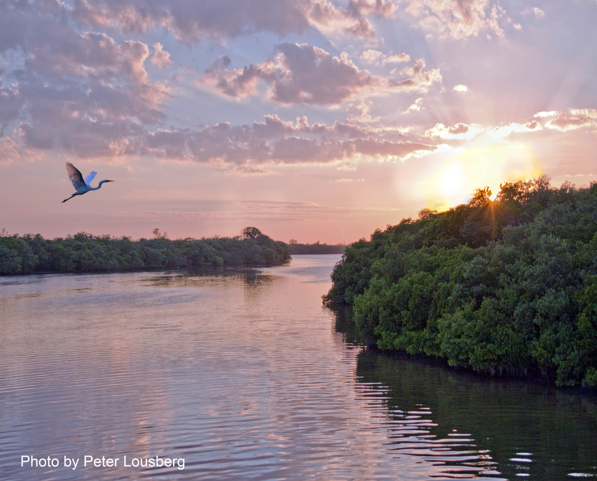
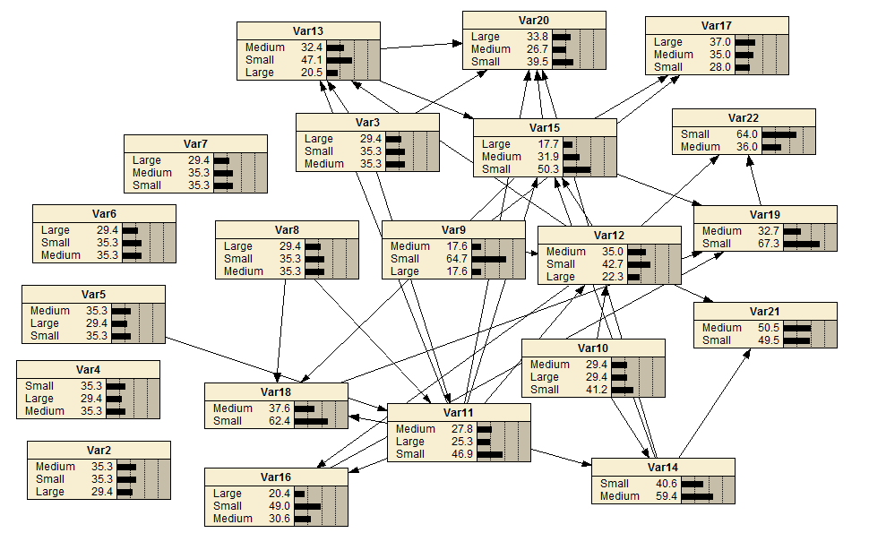
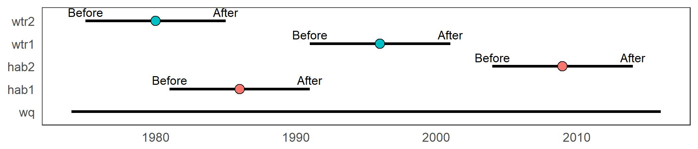

<insertHTML:[columns.html]

Use of prior knowledge to inform restoration projects in estuaries of GOM
========================================================
date: July 28, 2017
autosize: true
css: oss.css


```r
# randomize author order
aut <- c('Marcus Beck', 'Kirsten Dorans', 'Jessica Renee Henkel', 'Kathryn Ireland', 'Ed Sherwood', 'Patricia Varela') %>% 
  sample %>% 
  paste(collapse = ', ')

cat('By', aut)
```

```
By Marcus Beck, Ed Sherwood, Kathryn Ireland, Jessica Renee Henkel, Patricia Varela, Kirsten Dorans
```
  
Deepwater Horizon Settlement Agreement
========================================================


Over $10B in Potential Restoration Activities
========================================================


Cumulative Effects of Restoration Activities?
========================================================


* Vision to make it portable
* Why Bayesian networks

Benefits
=============

* A general and flexible framework that can be applied to unique locations and is not limited by data availability
* Explicit quantification of uncertainty and model updates with new data
* More focused restoration towards specific regional issues
* Improved ability to predict outcomes of proposed restoration projects

Tampa Bay was gross
========================================================


Tampa Bay is not as gross
========================================================


Tampa Bay is not as gross
========================================================


But how much less gross??
========================================================


But how much less gross??
========================================================

Ed 
* Tampa Bay Background

Tampa Bay Data Sources
========================================================
incremental: false

<div align="center">

</div>

***
* Rich WQ Monitoring Datatset (1974-)
      * Chlorophyll, salinity, dissolved oxygen, etc.
      * Depth-integrated
      * QAQC
* Time series, monthly step - ~500 obs. per site

Tampa Bay Restoration Sites
===============

<div align="center">

</div>

***
* Restoration sites in Tampa Bay, watershed
      * Habitat Establishment
      * Habitat Enhancement
      * Habitat Protection
      * Stormwater Controls
      * Point Source Controls
* 571 projects, 1971 - 2016


Workflow
========================================================
Kirsten/Katie
* Model diagram
* Merging restoration diagram

Data plyring
========================================================
incremental: true

* Can we identify a change in water quality from restoration?
* What data do we have?
* Can we plyr the data to identify a signal?
* Can we plyr the data as input to a BN?

Data plyring
========================================================
incremental: false


WQ and restoration sites
<div align="center">

</div>

***

* Can we plyr the data to identify a signal?
* How can continuous water quality be linked to discrete restoration activites?

Data plyring
========================================================
incremental: false
transition: none

WQ and restoration sites
<div align="center">

</div>

***

* Can we plyr the data to identify a signal?
* How can continuous water quality be linked to discrete restoration activites?
* Consider an effect of restoration **site type**?

Data plyring
========================================================
incremental: false
transition: none

WQ and restoration sites
<div align="center">

</div>

***

* Can we plyr the data to identify a signal?
* How can continuous water quality be linked to discrete restoration activites?
* Consider an effect of **site type**?
* Consider **distance** of sites from water quality stations?

Data plyring
========================================================
incremental: false
transition: none

WQ and restoration sites
<div align="center">

</div>

***

* Can we plyr the data to identify a signal?
* How can continuous water quality be linked to discrete restoration activites?
* Consider an effect of **site type**?
* Consider **distance** of sites from water quality stations?
* Consider a **cumulative effect**?

Data plyring
========================================================
incremental: false
transition: none

WQ and restoration sites
<div align="center">

</div>

***

* Can we plyr the data to identify a signal?
* How can continuous water quality be linked to discrete restoration activites?
* Consider an effect of **site type**?
* Consider **distance** of sites from water quality stations?
* Consider a **cumulative effect**?

Data plyring
========================================================
transition: none


WQ and restoration sites: **Spatial match**

<div align="center">

</div>

Data plyring
========================================================
transition: none

WQ and restoration sites: **Spatial match**
<div align="center">

</div>

WQ and restoration sites: **Temporal match**
<div align="center">

</div>

Data plyring
========================================================
transition: none

WQ and restoration sites: **Spatial match**
<div align="center">

</div>

WQ and restoration sites: **Temporal match**, **before/after**
<div align="center">

</div>

Data plyring
========================================================
transition: none

WQ and restoration sites: **Spatial match**
<div align="center">

</div>

WQ and restoration sites: **Temporal match**, **before/after**, **slice**
<div align="center">

</div>


Bayesian Network
========================================================
Patricia
* Specifics of BN
* Outcomes/interpretation/applications

Conclusion
========================================================
* Next steps (all)
