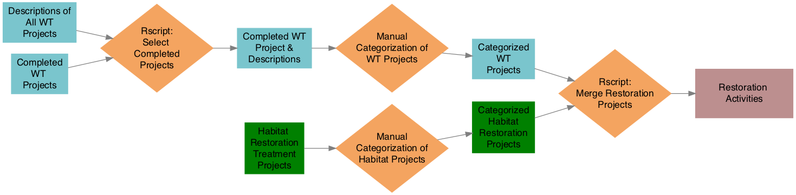
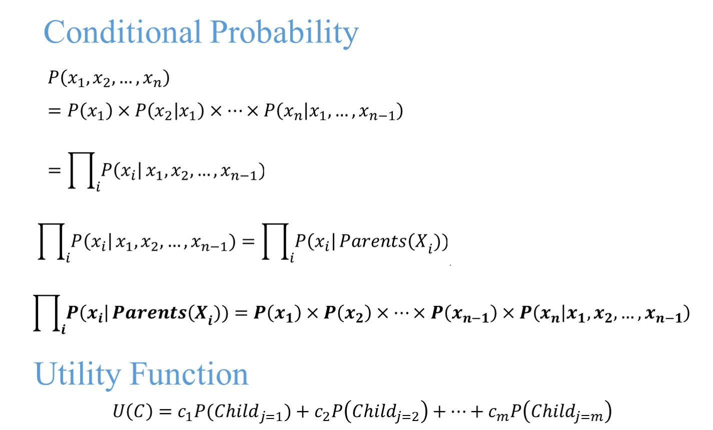
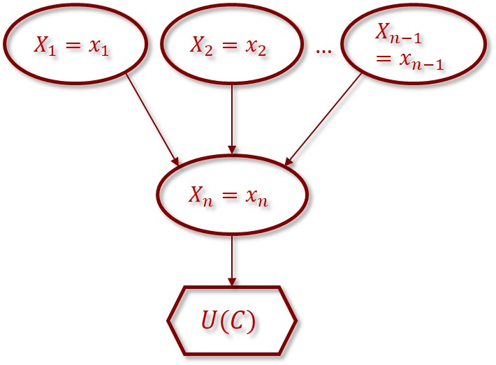
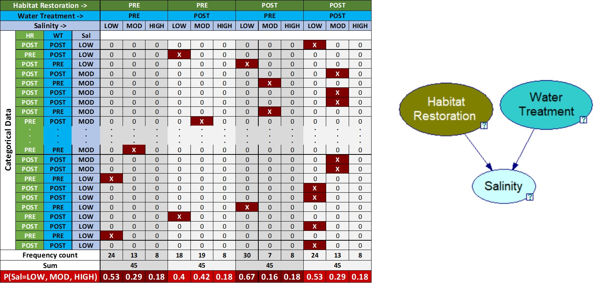

<insertHTML:[columns.html]

Use of prior knowledge to inform restoration projects in estuaries of GOM - Supplement
========================================================
date: July 28, 2017
autosize: true
css: oss.css
transition: none


```r
# randomize author order
aut <- c('Marcus Beck', 'Kirsten Dorans', 'Jessica Renee Henkel', 'Kathryn Ireland', 'Ed Sherwood', 'Patricia Varela') %>% 
  sample %>% 
  paste(collapse = ', ')
```
By Kathryn Ireland, Ed Sherwood, Kirsten Dorans, Jessica Renee Henkel, Marcus Beck, Patricia Varela

Developing Restoration Dataset
========================================================


Developing Restoration Dataset
========================================================
* Merge the WT Projects with the Habitat Restoration Projects
   * *filter* on lat/lon, separate into tables of activity location vs tables of activity & technology, combine WT/Habitat location tables, combine WT/Habitat descriptive tables
  * All Restoration Activities
    * 5 types of project activities

```
[1] "HABITAT_ENHANCEMENT"   "HABITAT_ESTABLISHMENT" "HABITAT_PROTECTION"   
[4] "NONPOINT_SOURCE"       "POINT_SOURCE"         
```
 
Developing Restoration Dataset
========================================================
* 28 types of project technologies


```
 [1] "HYDROLOGIC_RESTORATION" "EXOTIC_CONTROL"        
 [3] "FW_WETLANDS"            "MANGROVES"             
 [5] "SALTMARSH"              "PROTECTION_MANAGEMENT" 
 [7] "SEAGRASS_HABITAT"       "OYSTER_HABITAT"        
 [9] "ACQUISITION"            "BMP_WETLAND_TREATMENT" 
[11] "BMP_BAFFLE_BOX"         "BMP_STORMWATER_POND"   
[13] "BMP_MANAGEMENT"         "BMP_ON_SITE"           
[15] "PS_TREATMENT"           "SEND_TO_WWTP"          
[17] "BMP_ALUM_TREATMENT"     "BMP_TREATMENT_TRAIN"   
[19] "UPLANDS"                "DREDGING"              
[21] "EDUCATION"              "INCREASE_REUSE"        
[23] "MANAGEMENT"             "ATMOSPHERIC_DEPOSITION"
[25] "REGULATION"             "BMP_CDS_UNIT"          
[27] "BMP_AGRICULTURAL"       "STREET_SWEEPING"       
```

Bayesian Networks
========================================================

<div align="center">

</div>

```{}
library(bnlearn)
net = model2network("[X1][X2][Xn][X_Child|X1:X2:Xn]")
```

***
<div align="center">

</div>

Training Conditional Probability Tables
========================================================
<div align="center">

</div>
