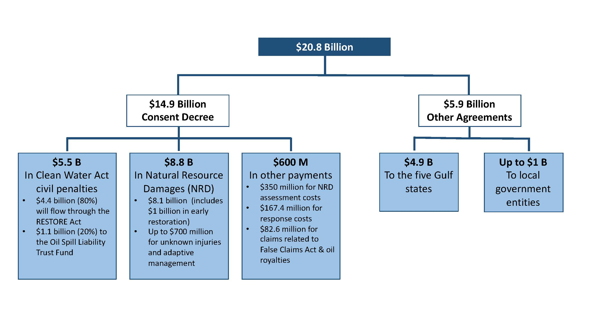
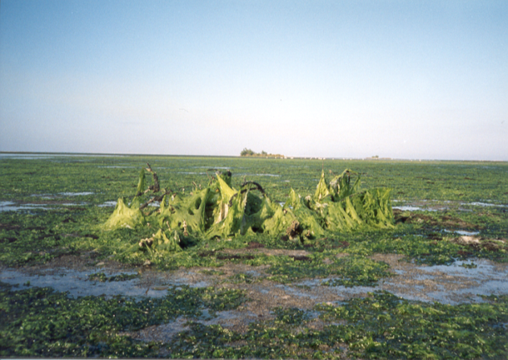
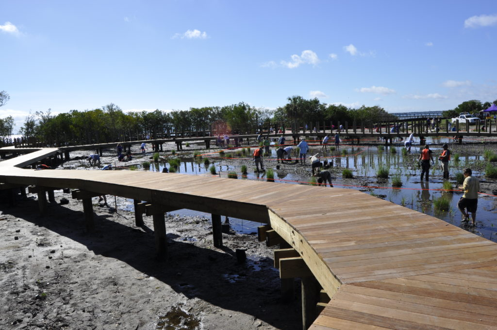
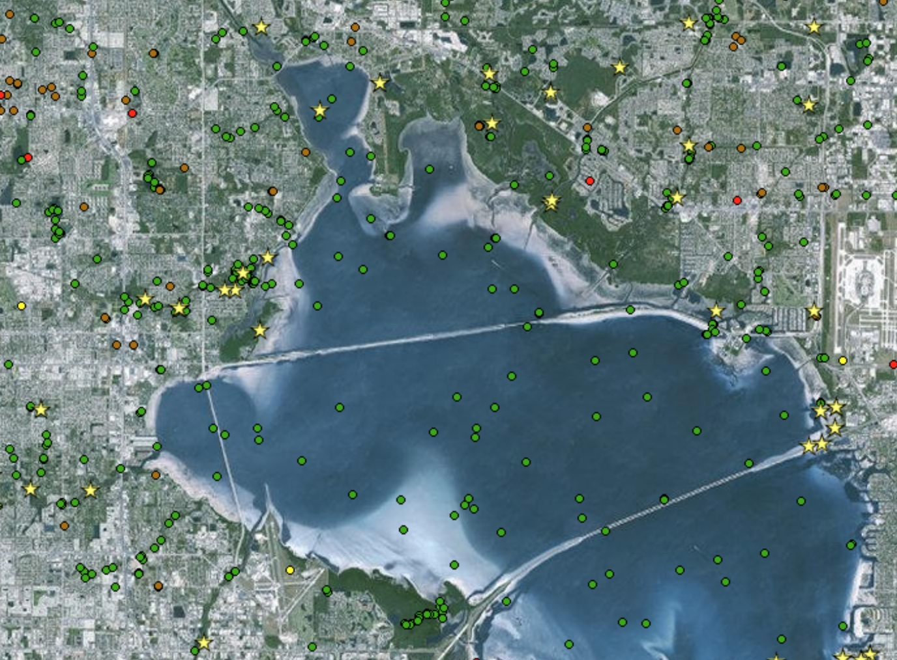
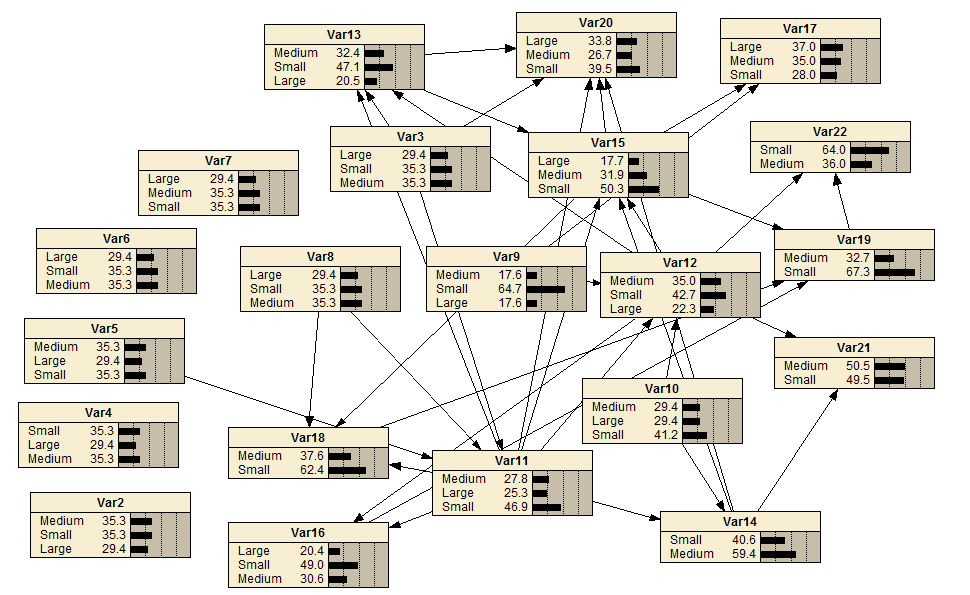

Use of prior knowledge to inform restoration projects in estuaries of GOM
========================================================
author: Beck, Varela, Sherwood, Ireland, Dorans, Henkel - in no particular order
date: July 14, 2017
autosize: true
css: oss.css

========================================================

Tampa Bay was gross
========================================================

Tampa Bay was gross
========================================================

Tampa Bay is not as gross
========================================================

Tampa Bay is not as gross
========================================================

But how much less gross??
========================================================

But how much less gross??
========================================================

Benefits
=============

* A general and flexible framework that can be applied to unique locations and is not limited by data availability
* Explicit quantification of uncertainty and model updates with new data
* More focused restoration towards specific regional issues
* Improved ability to predict outcomes of proposed restoration projects

