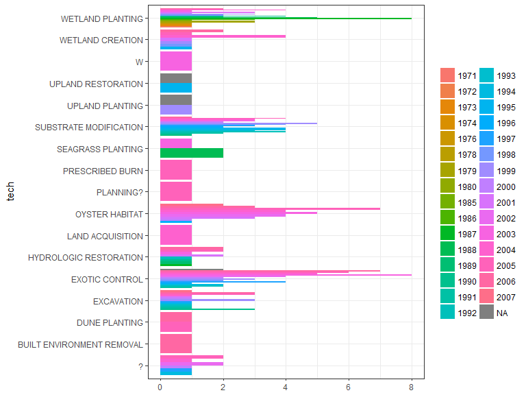
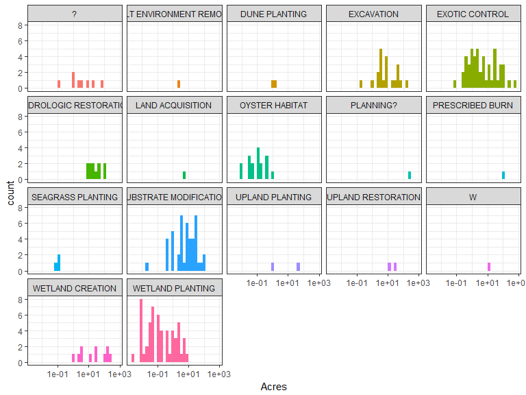
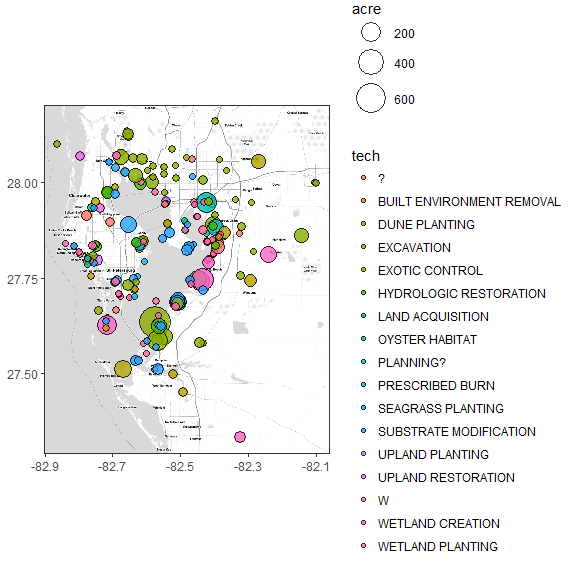
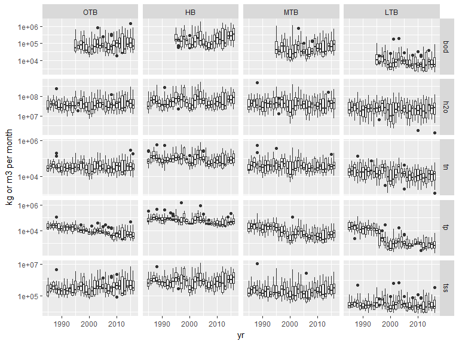
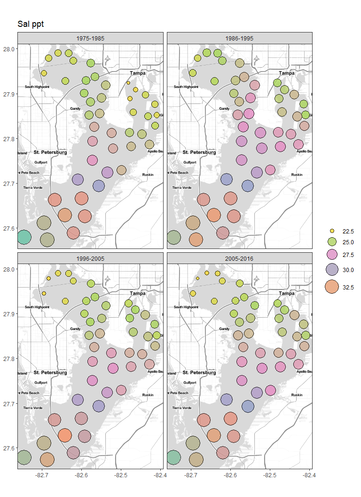
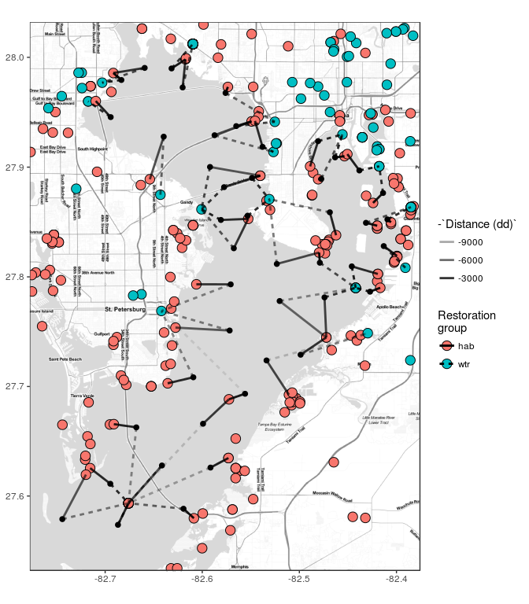

# Exploratory plots of restoration activities in TB

Load libraries:


```r
library(tidyverse)
library(readxl)
library(ggmap)
library(lubridate)
```

## Restoration data

Barplots of restoration projects by category, year:


```r
fl <- 'data-raw/TBEP_Restoration Database_11_21_07_JRH.csv'

# clean up habitat restoration data
dat <- fl %>% 
  read_csv %>% 
  select(Latitude, Longitude, Project_Completion_Date, `Restoration Category`, `Activity-1`, `Acres-1`) %>% 
  rename(
    lat = Latitude, 
    lon = Longitude, 
    date = Project_Completion_Date, 
    tech = `Restoration Category`, 
    type = `Activity-1`, 
    acre = `Acres-1`
  ) %>% 
  mutate(
    lat = as.numeric(lat),
    lon = as.numeric(lon),
    date = as.numeric(date),
    tech = toupper(tech)
  )
head(dat)
```

```
## # A tibble: 6 x 6
##        lat       lon  date                   tech          type  acre
##      <dbl>     <dbl> <dbl>                  <chr>         <chr> <dbl>
## 1 27.23300 -82.09700  2006       LAND ACQUISITION    Protection  50.0
## 2 27.93133 -82.73820  2005       WETLAND CREATION Establishment  14.0
## 3 27.95087 -82.54180  1998       WETLAND CREATION Establishment   3.0
## 4 27.88977 -82.39888  2005 HYDROLOGIC RESTORATION   Enhancement  12.8
## 5 27.88994 -82.40340  2004         EXOTIC CONTROL   Enhancement 123.9
## 6 27.97370 -82.71504  2006             EXCAVATION Establishment  20.0
```

```r
ggplot(dat, aes(tech, group = date, fill = factor(date))) + 
  geom_bar(position = 'dodge') + 
  theme_bw() + 
  coord_flip() + 
  theme(
    axis.title.x = element_blank(), 
    legend.title = element_blank()
    )
```

<!-- -->

```r
ggplot(dat, aes(acre, group = tech, fill = tech)) + 
  geom_histogram() + 
  scale_x_log10('Acres') + 
  facet_wrap(~tech) + 
  theme_bw() + 
  theme(
    legend.position = 'none'
  )
```

<!-- -->

Map of restoration sites and acreage reported:


```r
toplo <- filter(dat, lat > 27.3 & lat < 28.2)  

# extent
ext <- make_bbox(toplo$lon, toplo$lat)
map <- get_stamenmap(ext, zoom = 11, maptype = "toner-lite")

# base map
pbase <- ggmap(map) +
  theme_bw() +
  theme(
    axis.title.x = element_blank(),
    axis.title.y = element_blank()
  ) +
  geom_point(data = toplo, aes(size = acre, fill = tech), pch = 21, colour = 'black', alpha = 0.8) + 
  scale_size(range = c(2, 11))
pbase
```

<!-- -->

## Load data


```r
loads <- read_excel('data-raw/loads.xlsx')

dat <- loads %>% 
  filter(!`Bay Segment` %in% c(5, 6, 7)) %>% 
  rename(
    seg = `Bay Segment`,
    h2o = `H2O Load (m3/month)`,
    tn = `TN Load (kg/month)`,
    tp = `TP Load (kg/month)`, 
    tss = `TSS Load (kg/month)`,
    bod = `BOD Load (kg/month)`, 
    yr = Year, 
    mo = Month
    ) %>% 
  gather('var', 'val', h2o:bod) %>% 
  mutate(
    val = as.numeric(val),
    seg = factor(seg, levels = c('1', '2', '3', '4'), labels = c('OTB', 'HB', 'MTB', 'LTB'))
    ) %>% 
  group_by(seg, yr, mo, var) %>% 
  summarise(val = sum(val, na.rm = TRUE))

ggplot(dat, aes(x = yr, y = val, group = yr)) + 
  geom_boxplot() + 
  facet_grid(var~seg, scales = 'free_y') + 
  scale_y_log10('kg or m3 per month')
```

<!-- -->

## WQ data


```r
wqdat_raw <- read_csv('data-raw/epchc_clean_data_07162017.csv')

# rename, select relevant columns, integrate variables across depths
# annual averages by site, variable
wqdat <- wqdat_raw %>% 
  rename(
    yr = YEAR,
    mo = month,
    dttm = SampleTime,
    stat = epchc_station, 
    lat = Latitude, 
    lon = Longitude, 
    seg = bay_segment, 
    sallo = Sal_Bottom_ppth, 
    salmd = Sal_Mid_ppth,
    salhi = Sal_Top_ppth, 
    dolo = DO_Bottom_mg_L,
    domd = DO_Mid_mg_L, 
    dohi = DO_Top_mg_L,
    chla = chl_a
  ) %>% 
  select(stat, yr, mo, dttm, lat, lon, seg, sallo, salmd, salhi, dolo, domd, dohi, chla) %>% 
  gather('var', 'val', sallo:chla) %>% 
  mutate(val = as.numeric(val)) %>% 
  spread('var', 'val') %>% 
  rowwise() %>%
  mutate(
    sal = mean(c(sallo, salmd, salhi), na.rm = TRUE),
    do = mean(c(dolo, domd, dohi), na.rm = TRUE)
  ) %>%
  select(-sallo, -salmd, -salhi, -dolo, -domd, -dohi, -dttm) %>% 
  gather('var', 'val', chla:do) %>% 
  group_by(stat, yr, seg, var, lat, lon) %>% 
  summarise(val = median(val, na.rm = TRUE)) %>% 
  ungroup %>% 
  mutate(
    yrcat = cut(yr, 
      breaks = c(-Inf, 1985, 1995, 2005, Inf), 
      labels = c('1975-1985', '1986-1995', '1996-2005', '2005-2016')
    )
  )
```

### Plot of ten-year medians {.tabset}

#### DO


```r
# take ten-year averages
wqdat_ten <- wqdat %>%
  group_by(stat, yrcat, seg, lat, lon, var) %>% 
  summarise(val = median(val, na.rm = TRUE))

# extent
ext <- make_bbox(wqdat_ten$lon, wqdat_ten$lat)
map <- get_stamenmap(ext, zoom = 11, maptype = "toner-lite")

# base map
pbase <- ggmap(map) +
  theme_bw() +
  theme(
    axis.title.x = element_blank(),
    axis.title.y = element_blank()
  ) +
  guides(fill=guide_legend(''), size = guide_legend('')) 
colpal <- 'Set2'

# do map
doplo <- filter(wqdat_ten, var %in% 'do')
pbase + 
  geom_point(data = doplo, aes(x = lon, y = lat, size = val, fill = val), pch = 21, colour = 'black', alpha = 0.8) + 
  scale_size('', range = c(2, 11)) + 
  scale_fill_distiller(palette = colpal) +
  facet_wrap(~yrcat) + 
  guides(fill=guide_legend(''), size = guide_legend('')) +
  ggtitle('DO mg/L') 
```

<!-- -->

#### Salinity

```r
# sal map
salplo <- filter(wqdat_ten, var %in% 'sal')
pbase + 
  geom_point(data = salplo, aes(x = lon, y = lat, size = val, fill = val), pch = 21, colour = 'black', alpha = 0.8) + 
  scale_size('', range = c(2, 11)) + 
  scale_fill_distiller(palette = colpal) +
  facet_wrap(~yrcat) + 
  guides(fill=guide_legend(''), size = guide_legend('')) +
  ggtitle('Sal ppt') 
```

<!-- -->

#### Chlorophyll

```r
# chl map
chlplo <- filter(wqdat_ten, var %in% 'chla')
pbase + 
  geom_point(data = chlplo, aes(x = lon, y = lat, size = val, fill = val), pch = 21, colour = 'black', alpha = 0.8) + 
  scale_size('', range = c(2, 11)) + 
  scale_fill_distiller(palette = colpal) +
  facet_wrap(~yrcat) +
  ggtitle('Chl-a ug/L') 
```

<!-- -->


         
