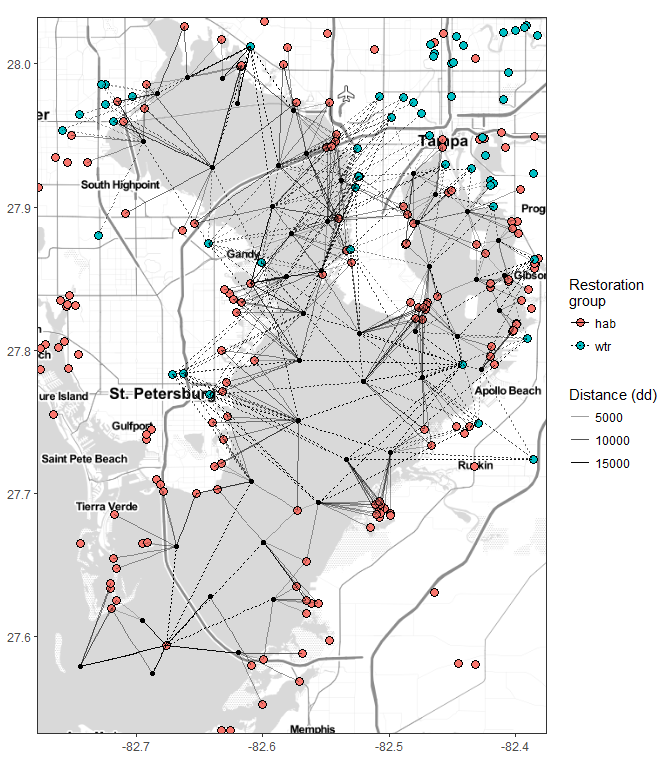
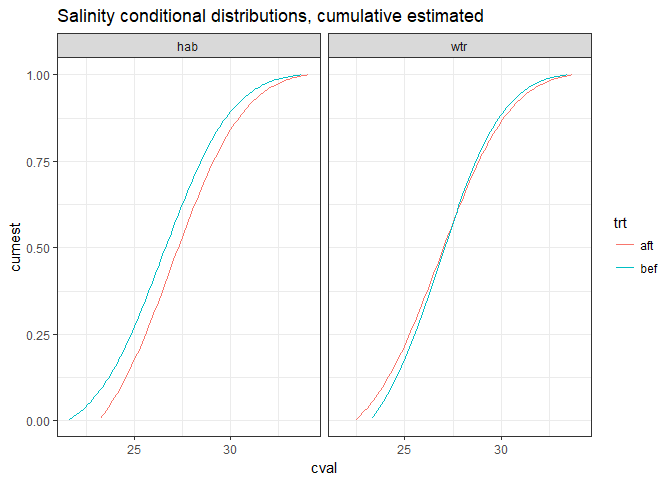
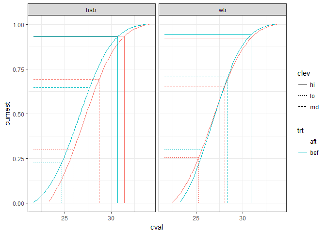

# Exploratory plots of restoration activities in TB


```r
library(tidyverse)
library(readxl)
library(ggmap)
library(lubridate)
library(geosphere)
library(stringi)
library(tibble)
knitr::knit('tbrest.Rmd', tangle = TRUE)
file.copy('tbrest.R', 'R/tbrest.R', overwrite = TRUE)
file.remove('tbrest.R')
```

## Restoration data


```r
data(restdat)
data(reststat)
```

Habitat restoration projects:

```r
head(restdat)
```

```
## # A tibble: 6 x 5
##    date                   tech                type  acre    id
##   <dbl>                  <chr>               <chr> <chr> <chr>
## 1  2005 HYDROLOGIC_RESTORATION HABITAT_ENHANCEMENT  12.8  Od6c
## 2  2004         EXOTIC_CONTROL HABITAT_ENHANCEMENT 123.9  jDZw
## 3  2005         EXOTIC_CONTROL HABITAT_ENHANCEMENT 123.9  ajg8
## 4  2006 HYDROLOGIC_RESTORATION HABITAT_ENHANCEMENT    45  off6
## 5  2000         EXOTIC_CONTROL HABITAT_ENHANCEMENT  0.25  kipZ
## 6  1989 HYDROLOGIC_RESTORATION HABITAT_ENHANCEMENT    50  4TdU
```
Locations of habitat restoration projects:

```r
head(reststat)
```

```
## # A tibble: 6 x 3
##      id      lat       lon
##   <chr>    <dbl>     <dbl>
## 1  Od6c 27.88977 -82.39888
## 2  jDZw 27.88994 -82.40340
## 3  ajg8 27.88181 -82.39783
## 4  off6 27.97370 -82.71504
## 5  kipZ 27.81921 -82.28548
## 6  4TdU 27.99817 -82.61724
```

## WQ data


```r
wqdat_raw <- read_csv('data-raw/epchc_clean_data_07162017.csv')

# rename, select relevant columns, integrate variables across depths
# annual averages by site, variable
wqdat <- wqdat_raw %>% 
  rename(
    yr = YEAR,
    mo = month,
    dttm = SampleTime,
    stat = epchc_station, 
    lat = Latitude, 
    lon = Longitude,
    sallo = Sal_Bottom_ppth, 
    salmd = Sal_Mid_ppth,
    salhi = Sal_Top_ppth, 
    dolo = DO_Bottom_mg_L,
    domd = DO_Mid_mg_L, 
    dohi = DO_Top_mg_L,
    chla = chl_a
  ) %>% 
  select(stat, yr, mo, dttm, lat, lon, sallo, salmd, salhi, dolo, domd, dohi, chla) %>% 
  gather('var', 'val', sallo:chla) %>% 
  mutate(val = as.numeric(val)) %>% 
  spread('var', 'val') %>% 
  rowwise() %>%
  mutate(
    sal = mean(c(sallo, salmd, salhi), na.rm = TRUE),
    do = mean(c(dolo, domd, dohi), na.rm = TRUE)
  ) %>%
  select(-sallo, -salmd, -salhi, -dolo, -domd, -dohi, -dttm) %>% 
  mutate(
    dy = 1
  ) %>% 
  unite('datetime', yr, mo, dy, sep = '-') %>% 
  mutate(
    datetime = as.Date(datetime, format = '%Y-%m-%d')
  )

# get station locations
wqstat <- wqdat %>% 
  select(stat, lon, lat) %>% 
  unique

# remove denormalized rows
wqdat <- wqdat %>% 
  select(-lon, -lat)
  
save(wqstat, file= 'data/wqstat.RData', compress = 'xz')
save(wqdat, file = 'data/wqdat.RData', compress = 'xz')
```

Water quality station lat/lon:

```r
head(wqstat)
```

```
## # A tibble: 6 x 3
##    stat      lon     lat
##   <int>    <dbl>   <dbl>
## 1    47 -82.6202 27.9726
## 2    60 -82.6316 27.9899
## 3    46 -82.6593 27.9904
## 4    64 -82.6833 27.9794
## 5    66 -82.6397 27.9278
## 6    40 -82.5873 27.9291
```

Water quality data:

```r
head(wqdat)
```

```
## # A tibble: 6 x 5
##    stat   datetime  chla   sal    do
##   <int>     <date> <dbl> <dbl> <dbl>
## 1    47 1974-01-01    NA  21.1   7.9
## 2    60 1974-01-01    NA  21.3   8.2
## 3    46 1974-01-01     3  17.4   8.3
## 4    64 1974-01-01     2  19.1   8.2
## 5    66 1974-01-01    NA  21.3   8.1
## 6    40 1974-01-01    NA  22.0   8.4
```

## Distance to restoration sites {.tabset}


```r
# get this many closest to each station
mtch <- 10

# join restoration site data and locs, make top level grouping column
restall <- left_join(restdat, reststat, by = 'id') %>% 
  mutate(
    top = ifelse(grepl('HABITAT', type), 'hab', 'wtr')
  )

# restoration project grouping column
resgrp <- 'top'
names(restall)[names(restall) %in% resgrp] <- 'resgrp'

# match habitat restoration locations with wq stations by closest mtch locations
wqmtch <- wqstat %>% 
  group_by(stat) %>% 
  nest %>% 
  mutate(
    clo = map(data, function(sta){

      # get top mtch closest restoration projects to each station
      # grouped by resgrp column
      dists <- distm(rbind(sta, restall[, c('lat', 'lon')])) %>%
        .[-1, 1] %>%
        data.frame(
          restall[, c('id', 'resgrp')],
          dist = ., stringsAsFactors = F
          ) %>%
        group_by(resgrp) %>%
        arrange(dist) %>% 
        nest %>%
        mutate(
          data = map(data, function(x) x[1:mtch, ]),
          rnk = map(data, function(x) seq(1:nrow(x)))
          ) %>% 
        unnest
      
      return(dists)
      
    })
  ) %>% 
  select(-data) %>% 
  unnest

head(wqmtch)
```

```
## # A tibble: 6 x 5
##    stat resgrp   rnk    id     dist
##   <int>  <chr> <int> <chr>    <dbl>
## 1    47    hab     1  4TdU 2861.746
## 2    47    hab     2  CpK7 2971.000
## 3    47    hab     3  XJkh 4526.348
## 4    47    hab     4  hIYO 4526.348
## 5    47    hab     5  E4PQ 4526.348
## 6    47    hab     6  8GWP 4526.348
```

### Closest 

```r
## 
# plots

# combine lat/lon for the plot
toplo <- wqmtch %>% 
  left_join(wqstat, by = 'stat') %>% 
  left_join(reststat, by = 'id') %>% 
  rename(
    `Restoration\ngroup` = resgrp,
    `Distance (dd)` = dist
  )
restall <- restall %>% 
  rename(
    `Restoration\ngroup` = resgrp
  )

# extent
ext <- make_bbox(wqstat$lon, wqstat$lat, f = 0.1)
map <- get_stamenmap(ext, zoom = 12, maptype = "toner-lite")

# base map
pbase <- ggmap(map) +
  theme_bw() +
  theme(
    axis.title.x = element_blank(),
    axis.title.y = element_blank()
  ) +
  geom_point(data = restall, aes(x = lon, y = lat, fill = `Restoration\ngroup`), size = 4, pch = 21) +
  geom_point(data = wqstat, aes(x = lon, y = lat), size = 2)

# closest
toplo1 <- filter(toplo, rnk %in% 1)

pbase + 
  geom_segment(data = toplo1, aes(x = lon.x, y = lat.x, xend = lon.y, yend = lat.y, alpha = -`Distance (dd)`, linetype = `Restoration\ngroup`), size = 1)
```

<!-- -->

### Closest five

```r
# closest five
toplo2 <- filter(toplo, rnk %in% c(1:5))

pbase + 
  geom_segment(data = toplo2, aes(x = lon.x, y = lat.x, xend = lon.y, yend = lat.y, alpha = -`Distance (dd)`, linetype = `Restoration\ngroup`), size = 1)
```

<!-- -->

### Closest ten

```r
# closest twenty
toplo3 <- filter(toplo, rnk %in% c(1:10))

pbase + 
  geom_segment(data = toplo3, aes(x = lon.x, y = lat.x, xend = lon.y, yend = lat.y, alpha = -`Distance (dd)`, linetype = `Restoration\ngroup`), size = 1)
```

<!-- -->

## Summarizing effects of restoration projects

Get weighted average of project type, treatment (before, after) of salinity for all wq station, restoration site combinations.

```r
# diff to summarize wq data, in years before/after restoration projects
yrdf <- 5

# get only sal dat
saldat <- wqdat %>%
  select(-chla, -do)

# get weighted means of salinity for restoration treatments, types
wqchng <- wqmtch %>%
  left_join(restdat, by = 'id') %>%
  select(-tech, -type, -acre) %>% 
  mutate(
    date = paste0(date, '-07-01'),
    date = as.Date(date, format = '%Y-%m-%d'), 
    wts = dist / min(dist),
    wts = 1 / wts
    ) %>%
  split(.$stat) %>%
  map(., function(x){

    # iterate through the restoration sites closest to each wq station
    bysta <- x %>%
      group_by(rnk, resgrp) %>%
      nest %>%
      mutate(
        wqchg = map(data, function(dt){

          # summarize before/after wq data based on restoration date

          # filter wq data by stat, get date bounds
          statdat <- filter(saldat, stat %in% dt$stat)
          orrng <- range(statdat$datetime)

          # get date range +/- restoratin proj defined by yrdf
          dtrng <- with(dt, c(date - yrdf * 365, date + yrdf * 365))

          ## get values within window in dtrng, only if dates available
          ## values are summarized as mean before/after
          bef <- NA; aft <- NA

          # before
          if(dtrng[1] >= orrng[1]){

            # summarizes values before
            bef <- filter(statdat, datetime >= dtrng[1] & datetime <= dt$date) %>%
              .$sal %>% 
              mean(na.rm = TRUE)

          }

          # after
          if(dtrng[2] <= orrng[2]){

            # summarize values after
            aft <- filter(statdat, datetime <= dtrng[2] & datetime >= dt$date) %>%
              .$sal %>% 
              mean(na.rm = TRUE)

          }

          # combine/return the wq station/restoration station summary
          out <- data.frame(bef = bef, aft = aft)
          return(out)

        })

      )

    # return the complete restoration summary
    bysta <- unnest(bysta)
    return(bysta)

  }) %>%
  do.call('rbind', .) %>%
  remove_rownames() %>% 
  gather('trt', 'val', bef:aft) %>% 
  group_by(stat, resgrp, trt) %>% 
  summarise(
    cval = weighted.mean(val, w = wts, na.rm = TRUE)
  )

head(wqchng)
```

```
## # A tibble: 6 x 4
## # Groups:   stat, resgrp [3]
##    stat resgrp   trt     cval
##   <int>  <chr> <chr>    <dbl>
## 1     6    hab   aft 24.67069
## 2     6    hab   bef 24.90016
## 3     6    wtr   aft 25.27052
## 4     6    wtr   bef 24.92134
## 5     7    hab   aft 25.92751
## 6     7    hab   bef 25.25877
```

Get conditional probability distributions for the restoration type, treatment effects, salinity as first child node in network. 

```r
# fit conditional distributions
wqcdist <- wqchng %>% 
  group_by(resgrp, trt) %>% 
  nest %>% 
  mutate(
    crv = map(data, function(x){

      est <- x$cval %>% 
        na.omit %>% 
        MASS::fitdistr('normal') %>% 
        .$estimate
      
      return(est)
      
      }
    ), 
    prd = pmap(list(data, crv), function(data, crv){
      
      cval <- range(data$cval, na.rm = TRUE)  
      cval <- seq(cval[1], cval[2], length = 100)
      est <- dnorm(cval, crv[1], crv[2]) %>% 
        data.frame(cval = cval, est = .) %>% 
        mutate(
         cumest = cumsum(est),
         cumest = cumest / max(cumest)
        )
      
      return(est)
      
      }
    )
  )

head(wqcdist)
```

```
## # A tibble: 4 x 5
##   resgrp   trt              data       crv                    prd
##    <chr> <chr>            <list>    <list>                 <list>
## 1    hab   aft <tibble [45 x 2]> <dbl [2]> <data.frame [100 x 3]>
## 2    hab   bef <tibble [45 x 2]> <dbl [2]> <data.frame [100 x 3]>
## 3    wtr   aft <tibble [45 x 2]> <dbl [2]> <data.frame [100 x 3]>
## 4    wtr   bef <tibble [45 x 2]> <dbl [2]> <data.frame [100 x 3]>
```

Empirical and estimated distributions.  

```r
# setup plots as empirical densities and estimated densities
toplo1 <- wqcdist %>% 
  select(resgrp, trt, data) %>% 
  unnest
toplo2 <- wqcdist %>% 
  select(resgrp, trt, prd) %>% 
  unnest
head(toplo1)
```

```
## # A tibble: 6 x 4
##   resgrp   trt  stat     cval
##    <chr> <chr> <int>    <dbl>
## 1    hab   aft     6 24.67069
## 2    hab   aft     7 25.92751
## 3    hab   aft     8 24.06296
## 4    hab   aft     9 26.78588
## 5    hab   aft    11 27.03418
## 6    hab   aft    13 27.41596
```

```r
head(toplo2)
```

```
## # A tibble: 6 x 5
##   resgrp   trt     cval        est      cumest
##    <chr> <chr>    <dbl>      <dbl>       <dbl>
## 1    hab   aft 23.23396 0.05901539 0.007213288
## 2    hab   aft 23.34354 0.06187009 0.014775499
## 3    hab   aft 23.45312 0.06477323 0.022692553
## 4    hab   aft 23.56271 0.06771886 0.030969643
## 5    hab   aft 23.67229 0.07070058 0.039611180
## 6    hab   aft 23.78187 0.07371156 0.048620742
```

```r
ggplot(toplo1, aes(cval)) + 
  geom_histogram(aes(y=..density..)) + 
  geom_line(data = toplo2, aes(x = cval, y = est), col = 'red') +
  facet_grid(resgrp ~ trt) +
  theme_bw() + 
  ggtitle('Salinity conditional distributions, empirical and estimated')
```

<!-- -->

```r
ggplot(toplo2, aes(x = cval, y = cumest, group = trt)) + 
  geom_line(aes(colour = trt)) + 
  facet_grid(~ resgrp) +
  theme_bw() + 
  ggtitle('Salinity conditional distributions, cumulative estimated')
```

<!-- -->

Quantile breaks of the estimated conditional probability distribution values, in thirds.

```r
salbrk <- toplo2 %>% 
  group_by(resgrp, trt) %>% 
  nest %>% 
  mutate(
    qts = map(data, function(x){
  
      out<- quantile(x$cval, c(0.25, 0.5, 0.75))
      return(out)
      
    }),
    brk = pmap(list(data, qts), function(data, qts){
      
      out <- approx(x = data$cval, y = data$cumest, xout = qts)
      out <- out$y
      return(out)
      
    }),
    clev = map(brk, function(x){
      
      out <- rank(x) %>% 
        factor(levels = c(1, 2, 3), labels = c('lo', 'md', 'hi')) %>% 
        as.character
        
      return(out)
      
    })
  ) %>% 
  select(-data) %>% 
  unnest

salbrk
```

```
## # A tibble: 12 x 5
##    resgrp   trt      qts       brk  clev
##     <chr> <chr>    <dbl>     <dbl> <chr>
##  1    hab   aft 25.94608 0.2986726    lo
##  2    hab   aft 28.65820 0.6919804    md
##  3    hab   aft 31.37031 0.9330526    hi
##  4    hab   bef 24.64153 0.2252350    lo
##  5    hab   bef 27.66066 0.6466346    md
##  6    hab   bef 30.67979 0.9317494    hi
##  7    wtr   aft 25.27537 0.2543405    lo
##  8    wtr   aft 28.08864 0.6547678    md
##  9    wtr   aft 30.90190 0.9242771    hi
## 10    wtr   bef 25.83250 0.2989815    lo
## 11    wtr   bef 28.37717 0.7051529    md
## 12    wtr   bef 30.92185 0.9421645    hi
```
A plot showing the breaks:

```r
ggplot(toplo2, aes(x = cval, y = cumest, group = trt)) + 
  geom_line(aes(colour = trt)) + 
  geom_segment(data = salbrk, aes(x = qts, y = 0, xend = qts, yend = brk, linetype = clev, colour = trt)) +
  geom_segment(data = salbrk, aes(x = min(toplo2$cval), y = brk, xend = qts, yend = brk, linetype = clev, colour = trt)) +
  facet_grid(~ resgrp) +
  theme_bw()
```

<!-- -->


