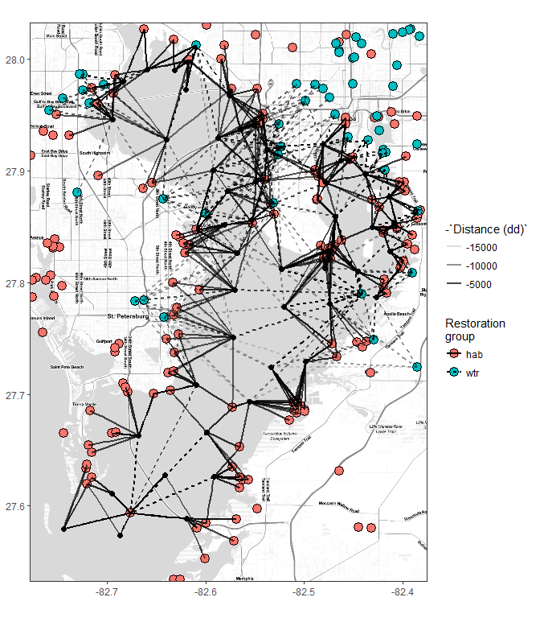

# Exploratory plots of restoration activities in TB

Load libraries:


```r
library(tidyverse)
library(readxl)
library(ggmap)
library(lubridate)
library(geosphere)
library(stringi)
```

## Restoration data

Barplots of restoration projects by category, year:


```r
fl <- 'data-raw/TBEP_Restoration Database_11_21_07_JRH.csv'

# clean up habitat restoration data
habdat <- fl %>% 
  read_csv %>% 
  select(Latitude, Longitude, Project_Completion_Date, `Restoration Category`, `Activity-1`, `Acres-1`) %>% 
  rename(
    lat = Latitude, 
    lon = Longitude, 
    date = Project_Completion_Date, 
    tech = `Restoration Category`, 
    type = `Activity-1`, 
    acre = `Acres-1`
  ) %>% 
  mutate(
    lat = as.numeric(lat),
    lon = as.numeric(lon),
    date = as.numeric(date),
    tech = toupper(tech)
  ) %>% 
  filter(lat > 27.3 & lat < 28.2)  

# habitat restoration station locs
habstat <- habdat %>% 
  mutate(id = stri_rand_strings(nrow(habdat), length = 4)) %>% 
  select(id, lat, lon) %>% 
  unique

# normalized habitat data
habdat <- habdat %>% 
  select(-lat, -lon)

save(habdat, file = 'data/habdat.RData', compress = 'xz')
save(habstat, file = 'data/habstat.RData', compress = 'xz')
```

Habitat restoration projects:

```r
head(habdat)
```

```
## # A tibble: 6 x 4
##    date                   tech          type  acre
##   <dbl>                  <chr>         <chr> <dbl>
## 1  2005       WETLAND CREATION Establishment  14.0
## 2  1998       WETLAND CREATION Establishment   3.0
## 3  2005 HYDROLOGIC RESTORATION   Enhancement  12.8
## 4  2004         EXOTIC CONTROL   Enhancement 123.9
## 5  2006             EXCAVATION Establishment  20.0
## 6  2006             EXCAVATION Establishment  26.0
```
Locations of habitat restoration projects:

```r
head(habstat)
```

```
## # A tibble: 6 x 3
##      id      lat       lon
##   <chr>    <dbl>     <dbl>
## 1  Fqqc 27.93133 -82.73820
## 2  Nrzi 27.95087 -82.54180
## 3  C4Qc 27.88977 -82.39888
## 4  BeJ0 27.88994 -82.40340
## 5  vjlb 27.97370 -82.71504
## 6  8Yju 27.97370 -82.71504
```

## Load data


```r
loads <- read_excel('data-raw/loads.xlsx')

lddat <- loads %>% 
  filter(!`Bay Segment` %in% c(5, 6, 7)) %>% 
  rename(
    seg = `Bay Segment`,
    h2o = `H2O Load (m3/month)`,
    tn = `TN Load (kg/month)`,
    tp = `TP Load (kg/month)`, 
    tss = `TSS Load (kg/month)`,
    bod = `BOD Load (kg/month)`, 
    yr = Year, 
    mo = Month
    ) %>% 
  gather('var', 'val', h2o:bod) %>% 
  mutate(
    val = as.numeric(val),
    seg = factor(seg, levels = c('1', '2', '3', '4'), labels = c('OTB', 'HB', 'MTB', 'LTB'))
    ) %>% 
  group_by(seg, yr, mo, var) %>% 
  summarise(val = sum(val, na.rm = TRUE))

ggplot(lddat, aes(x = yr, y = val, group = yr)) + 
  geom_boxplot() + 
  facet_grid(var~seg, scales = 'free_y') + 
  scale_y_log10('kg or m3 per month')
```

<!-- -->

## WQ data


```r
wqdat_raw <- read_csv('data-raw/epchc_clean_data_07162017.csv')

# rename, select relevant columns, integrate variables across depths
# annual averages by site, variable
wqdat <- wqdat_raw %>% 
  rename(
    yr = YEAR,
    mo = month,
    dttm = SampleTime,
    stat = epchc_station, 
    lat = Latitude, 
    lon = Longitude,
    sallo = Sal_Bottom_ppth, 
    salmd = Sal_Mid_ppth,
    salhi = Sal_Top_ppth, 
    dolo = DO_Bottom_mg_L,
    domd = DO_Mid_mg_L, 
    dohi = DO_Top_mg_L,
    chla = chl_a
  ) %>% 
  select(stat, yr, mo, dttm, lat, lon, sallo, salmd, salhi, dolo, domd, dohi, chla) %>% 
  gather('var', 'val', sallo:chla) %>% 
  mutate(val = as.numeric(val)) %>% 
  spread('var', 'val') %>% 
  rowwise() %>%
  mutate(
    sal = mean(c(sallo, salmd, salhi), na.rm = TRUE),
    do = mean(c(dolo, domd, dohi), na.rm = TRUE)
  ) %>%
  select(-sallo, -salmd, -salhi, -dolo, -domd, -dohi, -dttm) %>% 
  gather('var', 'val', chla:do) %>% 
  mutate(
    dy = 1
  ) %>% 
  unite('datetime', yr, mo, dy, sep = '-') %>% 
  mutate(
    datetime = as.Date(datetime, format = '%Y-%m-%d')
  )

# get station locations
wqstat <- wqdat %>% 
  select(stat, lon, lat) %>% 
  unique

# remove denormalized rows
wqdat <- wqdat %>% 
  select(-lon, -lat)
  
save(wqstat, file= 'data/wqstat.RData', compress = 'xz')
save(wqdat, file = 'data/wqdat.RData', compress = 'xz')
```

Water quality station lat/lon:

```r
head(wqstat)
```

```
## # A tibble: 6 x 3
##    stat      lon     lat
##   <int>    <dbl>   <dbl>
## 1    47 -82.6202 27.9726
## 2    60 -82.6316 27.9899
## 3    46 -82.6593 27.9904
## 4    64 -82.6833 27.9794
## 5    66 -82.6397 27.9278
## 6    40 -82.5873 27.9291
```

Water quality data:

```r
head(wqdat)
```

```
## # A tibble: 6 x 4
##    stat   datetime   var   val
##   <int>     <date> <chr> <dbl>
## 1    47 1974-01-01  chla    NA
## 2    60 1974-01-01  chla    NA
## 3    46 1974-01-01  chla     3
## 4    64 1974-01-01  chla     2
## 5    66 1974-01-01  chla    NA
## 6    40 1974-01-01  chla    NA
```

## Distance to restoration sites {.tabset}


```r
# load restoration and wq data 
data(habstat)
data(wqstat)

# get this many closest to each station
mtch <- 20

# match habitat restoration locations with wq stations by closest mtch locations
wqmtch <- wqstat %>% 
  group_by(stat) %>% 
  nest %>% 
  mutate(
    clo = map(data, function(sta){

      # get top mtch closest restoration projects to each station
      dists <- distm(rbind(sta, habstat[, -1])) %>%
        .[-1, 1] %>% 
        data.frame(habstat, dist = .) %>% 
        arrange(dist) %>% 
        .[1:mtch, ] %>% 
        data.frame(sta, ., rnk = 1:mtch)
      
      return(dists)
      
    })
  ) %>% 
  select(-data) %>% 
  unnest

head(wqmtch)
```

```
## # A tibble: 6 x 8
##    stat      lon     lat    id    lat.1     lon.1     dist   rnk
##   <int>    <dbl>   <dbl> <chr>    <dbl>     <dbl>    <dbl> <int>
## 1    47 -82.6202 27.9726  rOH9 27.99817 -82.61724 2861.746     1
## 2    47 -82.6202 27.9726  1lG6 27.99911 -82.61671 2971.000     2
## 3    47 -82.6202 27.9726  IZkU 27.97310 -82.57360 4581.869     3
## 4    47 -82.6202 27.9726  EqEM 27.99967 -82.58379 4678.879     4
## 5    47 -82.6202 27.9726  iLFR 28.01691 -82.63240 5075.789     5
## 6    47 -82.6202 27.9726  Dsua 28.01178 -82.58063 5843.654     6
```

### Closest 

```r
## 
# plots

# extent
ext <- make_bbox(habstat$lon, habstat$lat)
map <- get_stamenmap(ext, zoom = 11, maptype = "toner-lite")

# base map
pbase <- ggmap(map) +
  theme_bw() +
  theme(
    axis.title.x = element_blank(),
    axis.title.y = element_blank()
  ) +
  geom_point(data = habstat, aes(x = lon, y = lat), fill  = 'green', size = 3, pch = 21) +
  geom_point(data = wqstat, aes(x = lon, y = lat))

# closest
toplo1 <- filter(wqmtch, rnk %in% 1)

pbase + 
  geom_segment(data = toplo1, aes(x = lon, y = lat, xend = lon.1, yend = lat.1))
```

<!-- -->

### Closest five

```r
# closest five
toplo2 <- filter(wqmtch, rnk %in% c(1:5))

pbase + 
  geom_segment(data = toplo2, aes(x = lon, y = lat, xend = lon.1, yend = lat.1))
```

<!-- -->

### Closest twenty

```r
# closest twenty
toplo3 <- filter(wqmtch, rnk %in% c(1:20))

pbase + 
  geom_segment(data = toplo3, aes(x = lon, y = lat, xend = lon.1, yend = lat.1))
```

<!-- -->

         
