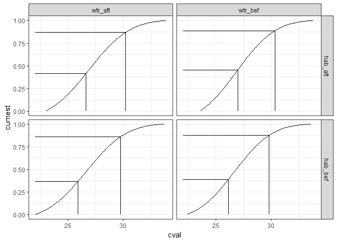
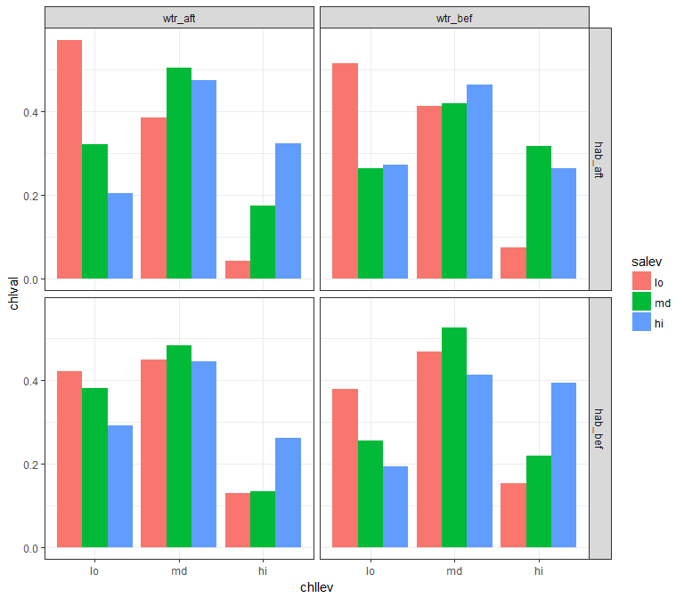
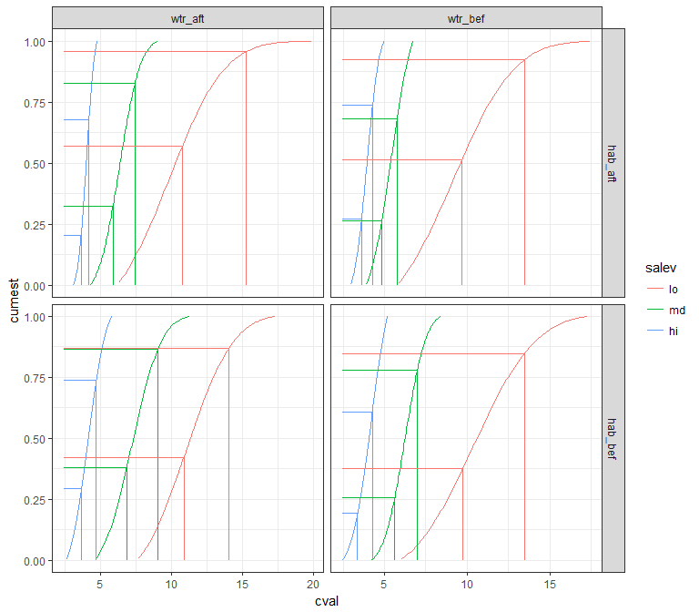

# Exploratory plots of restoration activities in TB


```r
library(tidyverse)
library(readxl)
library(ggmap)
library(lubridate)
library(geosphere)
library(stringi)
library(tibble)
library(leaflet)
knitr::knit('tbrest.Rmd', tangle = TRUE)
file.copy('tbrest.R', 'R/tbrest.R', overwrite = TRUE)
file.remove('tbrest.R')

# source R files
source('R/get_chg.R')
source('R/get_clo.R')
source('R/get_cdt.R')
source('R/get_brk.R')
```

## Restoration and water quality data


```r
# Load data
data(restdat)
data(reststat)
data(wqdat)
data(wqstat)

# Set parameters, yr half-window for matching, mtch is number of closest matches
yrdf <- 5
mtch <- 10
```

Restoration projects:

```r
head(restdat)
```

```
## # A tibble: 6 x 6
##    date                   tech                type   top  acre    id
##   <dbl>                  <chr>               <chr> <chr> <chr> <chr>
## 1  2005 HYDROLOGIC_RESTORATION HABITAT_ENHANCEMENT   hab  12.8  3F3S
## 2  2004         EXOTIC_CONTROL HABITAT_ENHANCEMENT   hab 123.9  6COa
## 3  2005         EXOTIC_CONTROL HABITAT_ENHANCEMENT   hab 123.9  F6iK
## 4  2006 HYDROLOGIC_RESTORATION HABITAT_ENHANCEMENT   hab    45  YqTO
## 5  2000         EXOTIC_CONTROL HABITAT_ENHANCEMENT   hab  0.25  OSr2
## 6  1989 HYDROLOGIC_RESTORATION HABITAT_ENHANCEMENT   hab    50  dLmu
```
Locations of restoration projects:

```r
head(reststat)
```

```
## # A tibble: 6 x 3
##      id      lat       lon
##   <chr>    <dbl>     <dbl>
## 1  3F3S 27.88977 -82.39888
## 2  6COa 27.88994 -82.40340
## 3  F6iK 27.88181 -82.39783
## 4  YqTO 27.97370 -82.71504
## 5  OSr2 27.81921 -82.28548
## 6  dLmu 27.99817 -82.61724
```
Water quality data:

```r
head(wqdat)
```

```
## # A tibble: 6 x 5
##    stat   datetime  chla   sal    do
##   <int>     <date> <dbl> <dbl> <dbl>
## 1    47 1974-01-01    NA  21.1   7.9
## 2    60 1974-01-01    NA  21.3   8.2
## 3    46 1974-01-01     3  17.4   8.3
## 4    64 1974-01-01     2  19.1   8.2
## 5    66 1974-01-01    NA  21.3   8.1
## 6    40 1974-01-01    NA  22.0   8.4
```
Locations of water quality sites:

```r
head(wqstat)
```

```
## # A tibble: 6 x 3
##    stat      lon     lat
##   <int>    <dbl>   <dbl>
## 1    47 -82.6202 27.9726
## 2    60 -82.6316 27.9899
## 3    46 -82.6593 27.9904
## 4    64 -82.6833 27.9794
## 5    66 -82.6397 27.9278
## 6    40 -82.5873 27.9291
```

## Distance to restoration sites {.tabset}


```r
wqmtch <- get_clo(restdat, reststat, wqstat, resgrp = 'top', mtch = mtch)
save(wqmtch, file = 'data/wqmtch.RData', compress = 'xz')

head(wqmtch)
```

```
## # A tibble: 6 x 5
##    stat resgrp   rnk    id     dist
##   <int>  <chr> <int> <chr>    <dbl>
## 1    47    hab     1  dLmu 2861.746
## 2    47    hab     2  DyAP 2971.000
## 3    47    hab     3  P2gv 4526.348
## 4    47    hab     4  Wxg6 4526.348
## 5    47    hab     5  ruky 4526.348
## 6    47    hab     6  cTzf 4526.348
```

### Closest 

```r
## 
# plots

# combine lat/lon for the plot
toplo <- wqmtch %>% 
  left_join(wqstat, by = 'stat') %>% 
  left_join(reststat, by = 'id') %>% 
  rename(
    `Restoration\ngroup` = resgrp,
    `Distance (dd)` = dist
  )
    
# restoration project grouping column
resgrp <- 'top'
restall <- left_join(restdat, reststat, by = 'id')
names(restall)[names(restall) %in% resgrp] <- 'Restoration\ngroup'

# extent
ext <- make_bbox(wqstat$lon, wqstat$lat, f = 0.1)
map <- get_stamenmap(ext, zoom = 12, maptype = "toner-lite")

# base map
pbase <- ggmap(map) +
  theme_bw() +
  theme(
    axis.title.x = element_blank(),
    axis.title.y = element_blank()
  ) +
  geom_point(data = restall, aes(x = lon, y = lat, fill = `Restoration\ngroup`), size = 4, pch = 21) +
  geom_point(data = wqstat, aes(x = lon, y = lat), size = 2)

# closest
toplo1 <- filter(toplo, rnk %in% 1)

pbase + 
  geom_segment(data = toplo1, aes(x = lon.x, y = lat.x, xend = lon.y, yend = lat.y, alpha = -`Distance (dd)`, linetype = `Restoration\ngroup`), size = 1)
```

<!-- -->

### Closest twenty percent

```r
# closest five percent
fvper <- max(toplo$rnk) %>% 
  `*`(0.2) %>% 
  ceiling
toplo2 <- filter(toplo, rnk %in% c(1:fvper))

pbase + 
  geom_segment(data = toplo2, aes(x = lon.x, y = lat.x, xend = lon.y, yend = lat.y, alpha = -`Distance (dd)`, linetype = `Restoration\ngroup`), size = 1)
```

<!-- -->

### Closest all combinations

```r
# closest all combo
toplo3 <- toplo

pbase + 
  geom_segment(data = toplo3, aes(x = lon.x, y = lat.x, xend = lon.y, yend = lat.y, alpha = -`Distance (dd)`, linetype = `Restoration\ngroup`), size = 1)
```

<!-- -->

### Leaflet in progress


```r
# dates for hab projects
restn <- restall %>% 
  select(id, date)
restall <- restall %>% 
  mutate(
    top = `Restoration\ngroup`
  )

#rest
lplo <- toplo1 %>% 
  select(stat, `Restoration\ngroup`, id, lon.x, lat.x, lat.y, lon.y) %>% 
  mutate(top = `Restoration\ngroup`) %>% 
  left_join(restn, by = 'id')
restln <- lplo %>% 
  gather('latgrp', 'lat', lat.x:lat.y) %>% 
  gather('longrp', 'lon', lon.x:lon.y)

pal <- colorFactor(c("navy", "red"), domain = c("hab", "wtr"))

leaflet(lplo) %>% 
  addTiles() %>%
  addProviderTiles(providers$CartoDB.Positron) %>% 
  addCircleMarkers(~lon.x, ~lat.x,
    radius = 4,
    color = 'green',
    stroke = FALSE, opacity = 0.8,
    popup = ~as.character(paste('WQ', stat)), 
    group = 'Water quality'
  ) %>% 
  addCircleMarkers(data = restall, ~lon, ~lat,
    radius = 6,
    color = ~pal(top),
    stroke = FALSE, opacity = 0.8, 
    popup = ~as.character(paste(top, date)), 
    group = 'Restoration sites'
  ) %>% 
  addLayersControl(
    overlayGroups = c('Water quality', 'Restoration sites'),
    options = layersControlOptions(collapsed = FALSE)
  )
```

<!--html_preserve--><div id="htmlwidget-88fc08caeaa7f0101bc9" style="width:672px;height:480px;" class="leaflet html-widget"></div>
<script type="application/json" data-for="htmlwidget-88fc08caeaa7f0101bc9">{"x":{"options":{"crs":{"crsClass":"L.CRS.EPSG3857","code":null,"proj4def":null,"projectedBounds":null,"options":{}}},"calls":[{"method":"addTiles","args":["//{s}.tile.openstreetmap.org/{z}/{x}/{y}.png",null,null,{"minZoom":0,"maxZoom":18,"maxNativeZoom":null,"tileSize":256,"subdomains":"abc","errorTileUrl":"","tms":false,"continuousWorld":false,"noWrap":false,"zoomOffset":0,"zoomReverse":false,"opacity":1,"zIndex":null,"unloadInvisibleTiles":null,"updateWhenIdle":null,"detectRetina":false,"reuseTiles":false,"attribution":"&copy; <a href=\"http://openstreetmap.org\">OpenStreetMap<\/a> contributors, <a href=\"http://creativecommons.org/licenses/by-sa/2.0/\">CC-BY-SA<\/a>"}]},{"method":"addProviderTiles","args":["CartoDB.Positron",null,null,{"errorTileUrl":"","noWrap":false,"zIndex":null,"unloadInvisibleTiles":null,"updateWhenIdle":null,"detectRetina":false,"reuseTiles":false}]},{"method":"addCircleMarkers","args":[[27.972601,27.972601,27.989901,27.989901,27.9904,27.9904,27.979401,27.979401,27.927799,27.927799,27.9291,27.9291,27.937401,27.937401,27.918501,27.918501,27.8902,27.8902,27.855801,27.855801,27.8118,27.8118,27.7932,27.7932,27.826099,27.826099,27.8519,27.8519,27.8818,27.8818,27.9002,27.9002,27.945601,27.945601,27.9676,27.9676,27.9237,27.9237,27.908899,27.908899,27.889299,27.889299,27.8589,27.8589,27.812901,27.812901,27.778,27.778,27.7813,27.7813,27.786501,27.786501,27.809601,27.809601,27.8281,27.8281,27.8493,27.8493,27.8524,27.8524,27.876499,27.876499,27.896999,27.896999,27.729,27.729,27.723801,27.723801,27.693399,27.693399,27.625999,27.625999,27.5884,27.5884,27.5737,27.5737,27.578899,27.578899,27.6112,27.6112,27.662701,27.662701,27.627899,27.627899,27.666,27.666,27.708401,27.708401,27.751101,27.751101],[-82.620201,-82.620201,-82.631599,-82.631599,-82.659302,-82.659302,-82.683296,-82.683296,-82.639702,-82.639702,-82.587303,-82.587303,-82.565002,-82.565002,-82.537903,-82.537903,-82.548798,-82.548798,-82.553299,-82.553299,-82.523201,-82.523201,-82.570702,-82.570702,-82.567497,-82.567497,-82.580803,-82.580803,-82.577499,-82.577499,-82.592003,-82.592003,-82.694298,-82.694298,-82.575996,-82.575996,-82.480698,-82.480698,-82.463203,-82.463203,-82.477402,-82.477402,-82.468597,-82.468597,-82.478897,-82.478897,-82.520302,-82.520302,-82.474098,-82.474098,-82.4272,-82.4272,-82.445999,-82.445999,-82.413101,-82.413101,-82.431396,-82.431396,-82.409302,-82.409302,-82.413803,-82.413803,-82.438202,-82.438202,-82.498703,-82.498703,-82.533798,-82.533798,-82.555901,-82.555901,-82.591499,-82.591499,-82.619301,-82.619301,-82.686798,-82.686798,-82.744102,-82.744102,-82.694702,-82.694702,-82.6679,-82.6679,-82.641502,-82.641502,-82.599197,-82.599197,-82.6092,-82.6092,-82.5718,-82.5718],4,null,"Water quality",{"lineCap":null,"lineJoin":null,"clickable":true,"pointerEvents":null,"className":"","stroke":false,"color":"green","weight":5,"opacity":0.8,"fill":true,"fillColor":"green","fillOpacity":0.2,"dashArray":null},null,null,["WQ 47","WQ 47","WQ 60","WQ 60","WQ 46","WQ 46","WQ 64","WQ 64","WQ 66","WQ 66","WQ 40","WQ 40","WQ 41","WQ 41","WQ 50","WQ 50","WQ 51","WQ 51","WQ 36","WQ 36","WQ 13","WQ 13","WQ 32","WQ 32","WQ 33","WQ 33","WQ 68","WQ 68","WQ 38","WQ 38","WQ 67","WQ 67","WQ 65","WQ 65","WQ 63","WQ 63","WQ 44","WQ 44","WQ 70","WQ 70","WQ 6","WQ 6","WQ 7","WQ 7","WQ 11","WQ 11","WQ 14","WQ 14","WQ 81","WQ 81","WQ 9","WQ 9","WQ 80","WQ 80","WQ 73","WQ 73","WQ 55","WQ 55","WQ 8","WQ 8","WQ 71","WQ 71","WQ 52","WQ 52","WQ 84","WQ 84","WQ 16","WQ 16","WQ 19","WQ 19","WQ 90","WQ 90","WQ 24","WQ 24","WQ 92","WQ 92","WQ 93","WQ 93","WQ 95","WQ 95","WQ 25","WQ 25","WQ 91","WQ 91","WQ 23","WQ 23","WQ 28","WQ 28","WQ 82","WQ 82"],null,null,null,null]},{"method":"addCircleMarkers","args":[[27.889773,27.889939,27.881813,27.973699,27.819212,27.998175,27.846975,27.82653,27.91383,27.862614,27.58,27.581,28.004,27.833333,28.026143,27.665089,27.792967,27.70147,27.700178,27.634717,27.579701,27.51181,27.710042,27.700178,27.51181,27.746511,27.860296,28.016907,27.625467,27.623001,27.806242,28.065278,28.132053,27.683,27.737405,27.948088,27.948088,27.7333,27.857,27.8958,28.0673,27.7029,27.7867,27.931328,27.950873,27.973699,27.973699,27.797005,27.973699,27.846975,27.846975,27.84223,27.84223,27.804005,27.999769,27.756927,27.997755,27.884955,28.157973,27.91273,28.029859,28.062113,28.058853,28.031179,28.09952,28.085833,28.040232,28.039338,27.99967,28.01178,28.021257,28.042935,28.059178,27.973164,28.010131,28.066195,27.956384,27.946404,27.484764,27.48341,27.874266,27.894883,27.90075,27.441202,27.554056,27.434273,27.472036,27.83381,27.83212,27.799882,27.65452,27.77111,27.77751,27.633305,27.68555,27.8215,27.8298,27.82885,27.66535,27.9459,27.8191,27.814882,27.81335,27.830498,27.741949,27.743245,27.892209,27.838335,27.832504,27.49809,27.450251,28.078317,28.119026,27.985731,27.719013,28.054001,27.95023,27.832504,27.892209,27.511447,27.634717,27.597167,27.587675,27.587675,28.05944,27.665612,27.838335,27.838335,27.831632,27.831632,27.818312,27.720628,27.689372,27.94235,27.753756,27.793232,27.795975,27.802673,27.941692,27.700178,27.616326,27.647553,27.51181,27.848224,27.84976,27.84414,27.84414,27.846636,27.846636,27.818312,27.999111,27.802259,27.744798,27.802673,27.625461,27.625461,27.705961,27.874716,27.552333,27.813016,27.8142,27.8609,27.941669,27.652461,27.841342,27.838335,27.829129,27.332,27.746904,27.790055,27.811355,27.885124,27.931575,27.888978,27.838,27.749293,27.832504,27.832504,27.686111,27.689836,27.691954,27.685963,27.69246,27.694443,27.686144,27.684603,27.685414,27.968614,27.8346,27.744798,27.533913,27.53394,27.6367,27.888986,28.039279,27.625461,27.83192,27.787403,28.053149,28.014751,27.82976,27.82976,27.822205,27.842593,27.83979,27.835347,27.71903,27.95212,28.026143,27.511605,27.622965,27.852878,27.584024,27.869478,27.568731,27.738062,27.745067,28.053149,28.068889,28.125278,27.8644,27.7414,27.6765,27.910009,27.9119,27.8346,27.947546,27.9731,27.947222,27.9417,27.942142,27.6883,27.842593,27.8674,27.8108,27.867207,27.816,27.873951,27.835,27.6195,27.8017,27.755,27.846975,27.935,27.869887,27.92362483,28.12181309,28.019236,28.019236,28.019236,27.988065,28.013639,28.05128459,28.019236,28.039363,27.826852,27.918834,27.863575,27.863575,27.863575,27.863575,27.662673,28.019236,27.927192,27.927192,27.927192,27.927192,27.916449,28.012172,27.95993401,28.012172,28.012172,28.012172,28.012172,28.012172,28.012172,28.012172,28.012172,28.012172,28.012172,28.012172,27.662673,27.662673,27.662673,27.662673,27.662673,27.662673,27.662673,27.59344,27.59344,27.59344,27.95993401,28.013639,27.962889,27.662673,27.662673,28.012172,27.86714745,28.012172,28.012172,28.012172,28.012172,28.012172,28.012172,27.86714745,27.86714745,28.019236,28.019236,27.860109,28.12855,27.880411,27.86714745,27.86714745,28.019236,28.019236,28.019236,27.86714745,27.86714745,27.86714745,27.86714745,27.79,28.019236,27.79,28.019236,28.012172,28.012172,28.012172,28.012172,28.012172,28.03999767,27.976967,28.012172,28.012172,28.019236,28.019236,28.019236,28.019236,27.936119,27.59344,28.012172,28.012172,28.012172,27.662673,27.662673,28.012172,27.88371021,27.86109007,27.949071,28.019236,28.019236,28.019236,28.012172,28.02665,28.019236,28.012172,28.068939,28.14314,28.084615,27.952572,27.723974,27.79,27.662673,27.962889,27.748674,27.744119,28.066534,27.863575,28.071189,27.86714745,27.86714745,28.012172,28.019236,28.019236,28.019236,28.019236,28.019236,27.59344,28.019236,28.012172,28.019236,28.019236,28.019236,28.019236,27.662673,27.59344,28.012172,28.019236,28.019236,28.019236,27.662673,27.59344,28.012172,28.019236,28.019236,28.019236,27.662673,27.59344,27.784186,28.025438,28.019236,27.975039,28.019236,28.023494,28.023494,28.019724,27.752228,28.019236,28.021363,28.019236,28.019236,27.863575,27.863575,27.863575,27.863575,27.89402,27.866425,27.866425,27.900782,28.160614,28.160614,27.89402,27.89402,27.662673,28.019236,28.019236,27.662673,28.012172,28.019236,27.662673,28.019236,28.019236,28.019236,28.019236,27.662673,27.662673,28.012172,28.012172,28.019236,28.019236,27.662673,27.662673,28.019236,28.019236,27.662673,28.012172,28.019236,27.662673,27.59344,27.59344,27.662673,27.662673,27.662673,27.662673,27.59344,27.59344,27.662673,27.662673,27.662673,27.662673,27.59344,27.662673,27.662673,27.900782,27.900782,27.916449,28.012172,27.59344,27.59344,27.59344,27.662673,27.63085538,27.492947,27.59344,27.59344,27.59344,27.59344,27.491669,27.59344,27.59344,27.59344,27.59344,27.79,28.019236,27.79,27.79,28.019236,28.012172,28.019236,28.019236,28.019236,27.662673,27.866425,28.012172,27.89003,28.019236,27.866425,27.86714745,28.012172,27.768576,27.947417,27.972052,28.012172,27.960191,28.012172,27.86714745,28.012172,28.012172,27.86714745,28.012172,28.012172,28.012172,28.019236,28.019236,27.988027,27.662673,27.857194,27.9607937,27.982428,27.86714745,27.86714745,27.96387,27.84879046,27.84879046,28.18612539,27.973438,27.87083871,27.9490062,28.02199831,27.91389095,28.00727349,28.00542371,27.94135476,27.92164991,28.00057518,27.92984072,27.97661666,27.96536341,28.0130837,28.00111631,27.921627,27.96238125,27.99428653,28.04722491,27.8892,27.98789,27.915475,27.8616,28.067864,27.50125472,27.782974,27.95379,27.986,27.986,27.964688,28.163949,27.768537,27.977424,27.950208,28.018916,28.109681,27.977424,27.768925,27.874894,27.880356,27.542371,28.047743,28.01956,27.857726,27.833169,28.107196,27.80833333],[-82.398876,-82.403398,-82.39783,-82.715043,-82.285483,-82.617238,-82.609493,-82.620776,-82.776859,-82.14458,-82.432,-82.445,-82.432,-82.616667,-82.662079,-82.744016,-82.777867,-82.678273,-82.652524,-82.57302,-82.608605,-82.576338,-82.683665,-82.652524,-82.576338,-82.446975,-82.384421,-82.6324,-82.715436,-82.561741,-82.756938,-82.675,-82.658019,-82.508,-82.631126,-82.424804,-82.424804,-82.4667,-82.385594,-82.7083,-82.7967,-82.6356,-82.7754,-82.738201,-82.541804,-82.715043,-82.715043,-82.745554,-82.715043,-82.609475,-82.609475,-82.390065,-82.390065,-82.771483,-82.105371,-82.324464,-82.098523,-82.319796,-82.396997,-82.396561,-82.598736,-82.63953,-82.612737,-82.364053,-82.862944,-82.524432,-82.580758,-82.547712,-82.583789,-82.580634,-82.549148,-82.514063,-82.384168,-82.547552,-82.511514,-82.48348,-82.338128,-82.291887,-82.354089,-82.355572,-82.487078,-82.485826,-82.48891,-82.431214,-82.320287,-82.440625,-82.36524,-82.46942,-82.47026,-82.63282,-82.71815,-82.63196,-82.62885,-82.72055,-82.71705,-82.4736,-82.47265,-82.4715,-82.6951,-82.5421,-82.39945,-82.40195,-82.40235,-82.75461,-82.440722,-82.292317,-82.540301,-82.752885,-82.812558,-82.521931,-82.491132,-82.676179,-82.653319,-82.691625,-82.637688,-82.268807,-82.751223,-82.812558,-82.540301,-82.669565,-82.57302,-82.547546,-82.568899,-82.568899,-82.466464,-82.691069,-82.752885,-82.752885,-82.747785,-82.747785,-82.399176,-82.632545,-82.503392,-82.45809,-82.627591,-82.606084,-82.419831,-82.419169,-82.549223,-82.652524,-82.565627,-82.715219,-82.576338,-82.405612,-82.40566,-82.419831,-82.419831,-82.419831,-82.419831,-82.399176,-82.616707,-82.761683,-82.472225,-82.419169,-82.565525,-82.565525,-82.680808,-82.486776,-82.600119,-82.402467,-82.4019,-82.3851,-82.408085,-82.565525,-82.83925,-82.752885,-82.387955,-82.322,-82.436726,-82.416695,-82.239696,-82.402507,-82.753931,-82.480643,-82.4622,-82.639292,-82.812558,-82.812558,-82.506944,-82.507512,-82.506783,-82.506673,-82.51073,-82.507368,-82.499258,-82.499355,-82.50991,-82.69359,-82.3957,-82.472225,-82.632219,-82.62577,-82.7203,-82.653974,-82.693374,-82.565525,-82.754396,-82.753628,-82.708918,-82.464601,-82.476617,-82.473317,-82.479637,-82.629808,-82.625822,-82.622798,-82.432454,-82.411395,-82.662079,-82.564149,-82.556267,-82.5527,-82.599459,-82.533754,-82.571038,-82.691463,-82.687888,-82.708918,-82.688333,-82.655,-82.3824,-82.6914,-82.5151,-82.453524,-82.4506,-82.3957,-82.428339,-82.5736,-82.458333,-82.4583,-82.545673,-82.5725,-82.629808,-82.4241,-82.7954,-82.325954,-82.7981,-82.431234,-82.76,-82.7198,-82.7756,-82.7649,-82.609493,-82.764,-82.371361,-82.38579458,-82.12251217,-82.21548,-82.21548,-82.21548,-82.373728,-82.467792,-82.26688174,-82.21548,-82.13978,-82.132505,-82.41985,-82.385047,-82.385047,-82.385047,-82.385047,-82.215645,-82.21548,-82.435207,-82.435207,-82.435207,-82.435207,-82.417664,-82.609611,-82.71747599,-82.609611,-82.609611,-82.609611,-82.609611,-82.609611,-82.609611,-82.609611,-82.609611,-82.609611,-82.609611,-82.609611,-82.215645,-82.215645,-82.215645,-82.215645,-82.215645,-82.215645,-82.215645,-82.675961,-82.675961,-82.675961,-82.71747599,-82.467792,-82.347508,-82.215645,-82.215645,-82.609611,-82.35780285,-82.609611,-82.609611,-82.609611,-82.609611,-82.609611,-82.609611,-82.35780285,-82.35780285,-82.21548,-82.21548,-82.279682,-82.154224,-82.199707,-82.35780285,-82.35780285,-82.21548,-82.21548,-82.21548,-82.35780285,-82.35780285,-82.35780285,-82.35780285,-82.442,-82.21548,-82.442,-82.21548,-82.609611,-82.609611,-82.609611,-82.609611,-82.609611,-82.71020925,-82.703099,-82.609611,-82.609611,-82.21548,-82.21548,-82.21548,-82.21548,-82.423841,-82.675961,-82.609611,-82.609611,-82.609611,-82.215645,-82.215645,-82.609611,-82.66328692,-82.53022555,-82.385384,-82.21548,-82.21548,-82.21548,-82.609611,-82.391748,-82.21548,-82.609611,-82.527091,-82.546069,-82.605692,-82.335168,-82.385701,-82.442,-82.215645,-82.347508,-82.429575,-82.290208,-82.453662,-82.385047,-82.129162,-82.35780285,-82.35780285,-82.609611,-82.21548,-82.21548,-82.21548,-82.21548,-82.21548,-82.675961,-82.21548,-82.609611,-82.21548,-82.21548,-82.21548,-82.21548,-82.215645,-82.675961,-82.609611,-82.21548,-82.21548,-82.21548,-82.215645,-82.675961,-82.609611,-82.21548,-82.21548,-82.21548,-82.215645,-82.675961,-82.662602,-82.393401,-82.21548,-82.40983,-82.21548,-82.400513,-82.400513,-82.382928,-82.335362,-82.21548,-82.457406,-82.21548,-82.21548,-82.385047,-82.385047,-82.385047,-82.385047,-81.973124,-81.928348,-81.928348,-82.417799,-82.153796,-82.153796,-81.973124,-81.973124,-82.215645,-82.21548,-82.21548,-82.215645,-82.609611,-82.21548,-82.215645,-82.21548,-82.21548,-82.21548,-82.21548,-82.215645,-82.215645,-82.609611,-82.609611,-82.21548,-82.21548,-82.215645,-82.215645,-82.21548,-82.21548,-82.215645,-82.609611,-82.21548,-82.215645,-82.675961,-82.675961,-82.215645,-82.215645,-82.215645,-82.215645,-82.675961,-82.675961,-82.215645,-82.215645,-82.215645,-82.215645,-82.675961,-82.215645,-82.215645,-82.417799,-82.417799,-82.417664,-82.609611,-82.675961,-82.675961,-82.675961,-82.215645,-82.46453374,-82.685755,-82.675961,-82.675961,-82.675961,-82.675961,-82.705239,-82.675961,-82.675961,-82.675961,-82.675961,-82.442,-82.21548,-82.442,-82.442,-82.21548,-82.609611,-82.21548,-82.21548,-82.21548,-82.215645,-81.928348,-82.609611,-82.239398,-82.21548,-81.928348,-82.35780285,-82.609611,-82.267185,-82.29465,-82.723811,-82.609611,-82.709688,-82.609611,-82.35780285,-82.609611,-82.609611,-82.35780285,-82.609611,-82.609611,-82.609611,-82.21548,-82.21548,-82.155848,-82.215645,-82.268657,-82.34500766,-82.352551,-82.35780285,-82.35780285,-81.968871,-81.90994263,-81.90994263,-82.26493835,-82.4806909,-82.53096503,-82.42654093,-82.41004183,-82.52669924,-82.46417885,-82.4648599,-82.52529097,-82.52332531,-82.45089214,-82.45563837,-82.48889106,-82.47430521,-82.4414387,-82.44902588,-82.524016,-82.49834043,-82.40599231,-82.44657091,-82.0919,-82.373728,-82.420308,-82.6008,-82.472364,-82.67930833,-82.671154,-82.75844,-82.7241,-82.7274,-82.744732,-82.147351,-81.943245,-82.451019,-82.4684,-82.447264,-82.766705,-82.507324,-82.642078,-82.643108,-82.729797,-82.367249,-82.580109,-82.115936,-82.346542,-82.483371,-82.094937,-82.39083333],6,null,"Restoration sites",{"lineCap":null,"lineJoin":null,"clickable":true,"pointerEvents":null,"className":"","stroke":false,"color":["#000080","#000080","#000080","#000080","#000080","#000080","#000080","#000080","#000080","#000080","#000080","#000080","#000080","#000080","#000080","#000080","#000080","#000080","#000080","#000080","#000080","#000080","#000080","#000080","#000080","#000080","#000080","#000080","#000080","#000080","#000080","#000080","#000080","#000080","#000080","#000080","#000080","#000080","#000080","#000080","#000080","#000080","#000080","#000080","#000080","#000080","#000080","#000080","#000080","#000080","#000080","#000080","#000080","#000080","#000080","#000080","#000080","#000080","#000080","#000080","#000080","#000080","#000080","#000080","#000080","#000080","#000080","#000080","#000080","#000080","#000080","#000080","#000080","#000080","#000080","#000080","#000080","#000080","#000080","#000080","#000080","#000080","#000080","#000080","#000080","#000080","#000080","#000080","#000080","#000080","#000080","#000080","#000080","#000080","#000080","#000080","#000080","#000080","#000080","#000080","#000080","#000080","#000080","#000080","#000080","#000080","#000080","#000080","#000080","#000080","#000080","#000080","#000080","#000080","#000080","#000080","#000080","#000080","#000080","#000080","#000080","#000080","#000080","#000080","#000080","#000080","#000080","#000080","#000080","#000080","#000080","#000080","#000080","#000080","#000080","#000080","#000080","#000080","#000080","#000080","#000080","#000080","#000080","#000080","#000080","#000080","#000080","#000080","#000080","#000080","#000080","#000080","#000080","#000080","#000080","#000080","#000080","#000080","#000080","#000080","#000080","#000080","#000080","#000080","#000080","#000080","#000080","#000080","#000080","#000080","#000080","#000080","#000080","#000080","#000080","#000080","#000080","#000080","#000080","#000080","#000080","#000080","#000080","#000080","#000080","#000080","#000080","#000080","#000080","#000080","#000080","#000080","#000080","#000080","#000080","#000080","#000080","#000080","#000080","#000080","#000080","#000080","#000080","#000080","#000080","#000080","#000080","#000080","#000080","#000080","#000080","#000080","#000080","#000080","#000080","#000080","#000080","#000080","#000080","#000080","#000080","#000080","#000080","#000080","#000080","#000080","#000080","#000080","#000080","#000080","#000080","#000080","#000080","#000080","#000080","#000080","#000080","#000080","#000080","#000080","#000080","#000080","#000080","#000080","#000080","#FF0000","#000080","#FF0000","#FF0000","#FF0000","#FF0000","#FF0000","#000080","#FF0000","#FF0000","#000080","#FF0000","#FF0000","#FF0000","#FF0000","#FF0000","#FF0000","#FF0000","#FF0000","#FF0000","#FF0000","#FF0000","#FF0000","#FF0000","#000080","#000080","#FF0000","#000080","#FF0000","#FF0000","#FF0000","#FF0000","#FF0000","#FF0000","#FF0000","#FF0000","#FF0000","#FF0000","#FF0000","#FF0000","#FF0000","#000080","#FF0000","#FF0000","#FF0000","#000080","#FF0000","#FF0000","#FF0000","#000080","#000080","#FF0000","#FF0000","#000080","#000080","#000080","#000080","#000080","#000080","#FF0000","#FF0000","#000080","#000080","#000080","#000080","#000080","#000080","#FF0000","#FF0000","#FF0000","#FF0000","#FF0000","#FF0000","#FF0000","#000080","#FF0000","#000080","#FF0000","#FF0000","#FF0000","#FF0000","#FF0000","#000080","#FF0000","#FF0000","#FF0000","#000080","#000080","#FF0000","#000080","#000080","#000080","#FF0000","#000080","#FF0000","#FF0000","#FF0000","#000080","#FF0000","#FF0000","#000080","#000080","#000080","#000080","#000080","#000080","#000080","#FF0000","#FF0000","#FF0000","#FF0000","#FF0000","#FF0000","#FF0000","#FF0000","#FF0000","#FF0000","#FF0000","#FF0000","#FF0000","#FF0000","#FF0000","#FF0000","#FF0000","#000080","#FF0000","#FF0000","#FF0000","#FF0000","#FF0000","#FF0000","#FF0000","#FF0000","#FF0000","#FF0000","#FF0000","#FF0000","#FF0000","#FF0000","#FF0000","#FF0000","#FF0000","#FF0000","#FF0000","#FF0000","#FF0000","#FF0000","#FF0000","#FF0000","#FF0000","#FF0000","#FF0000","#FF0000","#FF0000","#FF0000","#FF0000","#FF0000","#FF0000","#FF0000","#FF0000","#FF0000","#000080","#000080","#000080","#000080","#FF0000","#FF0000","#FF0000","#FF0000","#FF0000","#FF0000","#FF0000","#FF0000","#FF0000","#FF0000","#FF0000","#FF0000","#FF0000","#FF0000","#FF0000","#FF0000","#FF0000","#FF0000","#FF0000","#FF0000","#FF0000","#FF0000","#FF0000","#FF0000","#FF0000","#FF0000","#FF0000","#FF0000","#FF0000","#FF0000","#FF0000","#FF0000","#FF0000","#FF0000","#FF0000","#FF0000","#FF0000","#FF0000","#FF0000","#FF0000","#FF0000","#FF0000","#FF0000","#FF0000","#FF0000","#FF0000","#FF0000","#FF0000","#FF0000","#FF0000","#FF0000","#FF0000","#FF0000","#FF0000","#FF0000","#FF0000","#000080","#000080","#FF0000","#000080","#000080","#000080","#FF0000","#000080","#000080","#000080","#000080","#000080","#FF0000","#FF0000","#000080","#FF0000","#FF0000","#FF0000","#FF0000","#FF0000","#FF0000","#FF0000","#FF0000","#FF0000","#FF0000","#FF0000","#FF0000","#FF0000","#FF0000","#FF0000","#FF0000","#000080","#FF0000","#000080","#FF0000","#FF0000","#000080","#FF0000","#FF0000","#FF0000","#FF0000","#000080","#FF0000","#FF0000","#FF0000","#FF0000","#FF0000","#FF0000","#FF0000","#FF0000","#FF0000","#FF0000","#FF0000","#000080","#FF0000","#FF0000","#FF0000","#FF0000","#FF0000","#FF0000","#FF0000","#FF0000","#FF0000","#FF0000","#FF0000","#FF0000","#FF0000","#FF0000","#FF0000","#FF0000","#FF0000","#FF0000","#FF0000","#FF0000","#FF0000","#FF0000","#FF0000","#000080","#FF0000","#FF0000","#FF0000","#FF0000","#000080","#FF0000","#FF0000","#FF0000","#FF0000","#FF0000","#FF0000","#FF0000","#FF0000","#FF0000","#FF0000","#FF0000","#FF0000","#FF0000","#FF0000","#FF0000","#FF0000","#FF0000","#FF0000","#FF0000","#000080","#FF0000","#FF0000"],"weight":5,"opacity":0.8,"fill":true,"fillColor":["#000080","#000080","#000080","#000080","#000080","#000080","#000080","#000080","#000080","#000080","#000080","#000080","#000080","#000080","#000080","#000080","#000080","#000080","#000080","#000080","#000080","#000080","#000080","#000080","#000080","#000080","#000080","#000080","#000080","#000080","#000080","#000080","#000080","#000080","#000080","#000080","#000080","#000080","#000080","#000080","#000080","#000080","#000080","#000080","#000080","#000080","#000080","#000080","#000080","#000080","#000080","#000080","#000080","#000080","#000080","#000080","#000080","#000080","#000080","#000080","#000080","#000080","#000080","#000080","#000080","#000080","#000080","#000080","#000080","#000080","#000080","#000080","#000080","#000080","#000080","#000080","#000080","#000080","#000080","#000080","#000080","#000080","#000080","#000080","#000080","#000080","#000080","#000080","#000080","#000080","#000080","#000080","#000080","#000080","#000080","#000080","#000080","#000080","#000080","#000080","#000080","#000080","#000080","#000080","#000080","#000080","#000080","#000080","#000080","#000080","#000080","#000080","#000080","#000080","#000080","#000080","#000080","#000080","#000080","#000080","#000080","#000080","#000080","#000080","#000080","#000080","#000080","#000080","#000080","#000080","#000080","#000080","#000080","#000080","#000080","#000080","#000080","#000080","#000080","#000080","#000080","#000080","#000080","#000080","#000080","#000080","#000080","#000080","#000080","#000080","#000080","#000080","#000080","#000080","#000080","#000080","#000080","#000080","#000080","#000080","#000080","#000080","#000080","#000080","#000080","#000080","#000080","#000080","#000080","#000080","#000080","#000080","#000080","#000080","#000080","#000080","#000080","#000080","#000080","#000080","#000080","#000080","#000080","#000080","#000080","#000080","#000080","#000080","#000080","#000080","#000080","#000080","#000080","#000080","#000080","#000080","#000080","#000080","#000080","#000080","#000080","#000080","#000080","#000080","#000080","#000080","#000080","#000080","#000080","#000080","#000080","#000080","#000080","#000080","#000080","#000080","#000080","#000080","#000080","#000080","#000080","#000080","#000080","#000080","#000080","#000080","#000080","#000080","#000080","#000080","#000080","#000080","#000080","#000080","#000080","#000080","#000080","#000080","#000080","#000080","#000080","#000080","#000080","#000080","#000080","#FF0000","#000080","#FF0000","#FF0000","#FF0000","#FF0000","#FF0000","#000080","#FF0000","#FF0000","#000080","#FF0000","#FF0000","#FF0000","#FF0000","#FF0000","#FF0000","#FF0000","#FF0000","#FF0000","#FF0000","#FF0000","#FF0000","#FF0000","#000080","#000080","#FF0000","#000080","#FF0000","#FF0000","#FF0000","#FF0000","#FF0000","#FF0000","#FF0000","#FF0000","#FF0000","#FF0000","#FF0000","#FF0000","#FF0000","#000080","#FF0000","#FF0000","#FF0000","#000080","#FF0000","#FF0000","#FF0000","#000080","#000080","#FF0000","#FF0000","#000080","#000080","#000080","#000080","#000080","#000080","#FF0000","#FF0000","#000080","#000080","#000080","#000080","#000080","#000080","#FF0000","#FF0000","#FF0000","#FF0000","#FF0000","#FF0000","#FF0000","#000080","#FF0000","#000080","#FF0000","#FF0000","#FF0000","#FF0000","#FF0000","#000080","#FF0000","#FF0000","#FF0000","#000080","#000080","#FF0000","#000080","#000080","#000080","#FF0000","#000080","#FF0000","#FF0000","#FF0000","#000080","#FF0000","#FF0000","#000080","#000080","#000080","#000080","#000080","#000080","#000080","#FF0000","#FF0000","#FF0000","#FF0000","#FF0000","#FF0000","#FF0000","#FF0000","#FF0000","#FF0000","#FF0000","#FF0000","#FF0000","#FF0000","#FF0000","#FF0000","#FF0000","#000080","#FF0000","#FF0000","#FF0000","#FF0000","#FF0000","#FF0000","#FF0000","#FF0000","#FF0000","#FF0000","#FF0000","#FF0000","#FF0000","#FF0000","#FF0000","#FF0000","#FF0000","#FF0000","#FF0000","#FF0000","#FF0000","#FF0000","#FF0000","#FF0000","#FF0000","#FF0000","#FF0000","#FF0000","#FF0000","#FF0000","#FF0000","#FF0000","#FF0000","#FF0000","#FF0000","#FF0000","#000080","#000080","#000080","#000080","#FF0000","#FF0000","#FF0000","#FF0000","#FF0000","#FF0000","#FF0000","#FF0000","#FF0000","#FF0000","#FF0000","#FF0000","#FF0000","#FF0000","#FF0000","#FF0000","#FF0000","#FF0000","#FF0000","#FF0000","#FF0000","#FF0000","#FF0000","#FF0000","#FF0000","#FF0000","#FF0000","#FF0000","#FF0000","#FF0000","#FF0000","#FF0000","#FF0000","#FF0000","#FF0000","#FF0000","#FF0000","#FF0000","#FF0000","#FF0000","#FF0000","#FF0000","#FF0000","#FF0000","#FF0000","#FF0000","#FF0000","#FF0000","#FF0000","#FF0000","#FF0000","#FF0000","#FF0000","#FF0000","#FF0000","#FF0000","#000080","#000080","#FF0000","#000080","#000080","#000080","#FF0000","#000080","#000080","#000080","#000080","#000080","#FF0000","#FF0000","#000080","#FF0000","#FF0000","#FF0000","#FF0000","#FF0000","#FF0000","#FF0000","#FF0000","#FF0000","#FF0000","#FF0000","#FF0000","#FF0000","#FF0000","#FF0000","#FF0000","#000080","#FF0000","#000080","#FF0000","#FF0000","#000080","#FF0000","#FF0000","#FF0000","#FF0000","#000080","#FF0000","#FF0000","#FF0000","#FF0000","#FF0000","#FF0000","#FF0000","#FF0000","#FF0000","#FF0000","#FF0000","#000080","#FF0000","#FF0000","#FF0000","#FF0000","#FF0000","#FF0000","#FF0000","#FF0000","#FF0000","#FF0000","#FF0000","#FF0000","#FF0000","#FF0000","#FF0000","#FF0000","#FF0000","#FF0000","#FF0000","#FF0000","#FF0000","#FF0000","#FF0000","#000080","#FF0000","#FF0000","#FF0000","#FF0000","#000080","#FF0000","#FF0000","#FF0000","#FF0000","#FF0000","#FF0000","#FF0000","#FF0000","#FF0000","#FF0000","#FF0000","#FF0000","#FF0000","#FF0000","#FF0000","#FF0000","#FF0000","#FF0000","#FF0000","#000080","#FF0000","#FF0000"],"fillOpacity":0.2,"dashArray":null},null,null,["hab 2005","hab 2004","hab 2005","hab 2006","hab 2000","hab 1989","hab 2004","hab 1991","hab 2005","hab 2005","hab 2006","hab 2006","hab 2006","hab 2003","hab 2006","hab 2006","hab 1987","hab 1988","hab 1987","hab 1987","hab 1987","hab 1987","hab 1989","hab 1986","hab 1988","hab 2001","hab 2005","hab 2005","hab 2004","hab 1987","hab 1997","hab 2004","hab 2006","hab 2003","hab 1999","hab 2005","hab 2005","hab 2003","hab 2006","hab 2005","hab 2003","hab 2003","hab 1996","hab 2005","hab 1998","hab 2006","hab 2006","hab 1995","hab 2006","hab 2005","hab 2005","hab 1995","hab 1995","hab 2005","hab 1996","hab 1999","hab 2003","hab 2003","hab 2005","hab 2000","hab 1994","hab 2003","hab 2003","hab 2002","hab 2005","hab 2003","hab 2004","hab 2006","hab 2002","hab 1999","hab 1997","hab 1998","hab 1998","hab 2003","hab 1994","hab 1997","hab 1997","hab 2004","hab 2000","hab 2001","hab 2003","hab 2005","hab 2007","hab 2001","hab 2001","hab 2002","hab 2002","hab 2004","hab 2007","hab 2004","hab 2004","hab 2003","hab 2003","hab 2006","hab 2005","hab 2004","hab 2005","hab 2006","hab 2006","hab 2003","hab 2003","hab 2002","hab 2005","hab 1995","hab 2001","hab 2004","hab 1990","hab 1990","hab 1999","hab 2000","hab 1999","hab 2005","hab 2005","hab 1997","hab 1992","hab 1999","hab 2001","hab 1990","hab 1993","hab 2007","hab 1992","hab 2002","hab 2002","hab 2006","hab 1997","hab 2002","hab 1992","hab 1992","hab 2003","hab 2003","hab 2002","hab 2005","hab 1999","hab 2006","hab 1988","hab 1988","hab 1987","hab 1974","hab 1971","hab 1988","hab 1972","hab 1973","hab 1986","hab 1988","hab 1989","hab 1978","hab 1979","hab 1979","hab 1980","hab 1990","hab 1980","hab 2002","hab 1980","hab 1976","hab 1986","hab 1988","hab 1998","hab 1990","hab 1990","hab 1990","hab 2002","hab 2004","hab 1979","hab 1987","hab 1987","hab 1991","hab 2002","hab 2006","hab 2004","hab 2004","hab 2004","hab 1990","hab 1996","hab 1995","hab 2004","hab 1998","hab 1992","hab 1993","hab 2006","hab 2003","hab 2005","hab 2004","hab 1997","hab 1999","hab 1997","hab 1996","hab 2005","hab 1999","hab 2005","hab 1990","hab 1998","hab 1999","hab 2003","hab 2004","hab 1994","hab 1989","hab 1995","hab 1994","hab 1995","hab 1992","hab 1994","hab 1997","hab 1999","hab 1991","hab 1992","hab 1998","hab 2005","hab 1991","hab 1998","hab 2000","hab 1993","hab 1993","hab 1999","hab 2003","hab 1994","hab 1995","hab 2000","hab 1992","hab 2006","hab 2005","hab 2004","hab 2005","hab 2005","hab 2004","hab 2004","hab 2001","hab 1999","hab 2002","hab 2001","hab 2001","hab 1994","hab 2001","hab 1992","hab 2005","hab 2000","hab 2004","hab 2000","hab 1985","hab 1999","hab 2006","hab 2005","hab 2005","hab 1998","hab 2004","hab 2006","wtr 1997","hab 1999","wtr 1998","wtr 2001","wtr 2002","wtr 2000","wtr 1998","hab 1999","wtr 2002","wtr 2000","hab 1995","wtr 1996","wtr 1998","wtr 1996","wtr 1996","wtr 1997","wtr 1995","wtr 1994","wtr 1993","wtr 1994","wtr 1997","wtr 1997","wtr 1997","wtr 1996","hab 2001","hab 1998","wtr 2012","hab 1993","wtr 1995","wtr 1994","wtr 1997","wtr 1995","wtr 2002","wtr 1997","wtr 2002","wtr 2004","wtr 1998","wtr 2000","wtr 1998","wtr 1998","wtr 1997","hab 1995","wtr 1999","wtr 2000","wtr 2000","hab 2000","wtr 1999","wtr 2002","wtr 2006","hab 1996","hab 2006","wtr 2012","wtr 2000","hab 2001","hab 2001","hab 2001","hab 2001","hab 2001","hab 2001","wtr 2005","wtr 2005","hab 1996","hab 1997","hab 1997","hab 1997","hab 1999","hab 1995","wtr 2000","wtr 2005","wtr 2005","wtr 2011","wtr 2002","wtr 2002","wtr 2000","hab 1997","wtr 2004","hab 2004","wtr 2000","wtr 2003","wtr 2006","wtr 2002","wtr 2001","hab 2001","wtr 1992","wtr 2003","wtr 2008","hab 2009","hab 1997","wtr 2003","hab 2001","hab 2003","hab 2002","wtr 2006","hab 2004","wtr 2002","wtr 2002","wtr 2002","hab 2002","wtr 2002","wtr 2002","hab 2004","hab 2004","hab 2005","hab 2004","hab 2004","hab 2004","hab 2011","wtr 2001","wtr 2000","wtr 1997","wtr 1995","wtr 1995","wtr 1995","wtr 1995","wtr 1995","wtr 2001","wtr 2009","wtr 2006","wtr 1999","wtr 2004","wtr 2002","wtr 2011","wtr 2009","wtr 2004","hab 2004","wtr 2003","wtr 2003","wtr 2003","wtr 2003","wtr 2003","wtr 2003","wtr 2003","wtr 2003","wtr 2004","wtr 2004","wtr 2004","wtr 2004","wtr 2004","wtr 2004","wtr 2004","wtr 2005","wtr 2005","wtr 2005","wtr 2005","wtr 2005","wtr 2005","wtr 2002","wtr 2002","wtr 2002","wtr 2002","wtr 2002","wtr 2002","wtr 2011","wtr 2003","wtr 2005","wtr 2006","wtr 1998","wtr 2005","wtr 2005","wtr 2004","wtr 2002","hab 2002","hab 2002","hab 2004","hab 2004","wtr 2004","wtr 2003","wtr 2004","wtr 2005","wtr 2005","wtr 2001","wtr 2006","wtr 2005","wtr 1999","wtr 2004","wtr 2006","wtr 2010","wtr 1995","wtr 1995","wtr 1995","wtr 1995","wtr 1995","wtr 1995","wtr 1995","wtr 1995","wtr 2000","wtr 1995","wtr 2000","wtr 1995","wtr 2000","wtr 1995","wtr 2004","wtr 1995","wtr 2000","wtr 1995","wtr 2000","wtr 1995","wtr 1995","wtr 1995","wtr 1995","wtr 1995","wtr 1995","wtr 1995","wtr 2000","wtr 1995","wtr 2000","wtr 1995","wtr 2000","wtr 1995","wtr 2000","wtr 1995","wtr 2000","wtr 1995","wtr 2000","wtr 1995","wtr 1995","wtr 1995","wtr 1998","wtr 2005","wtr 2005","wtr 2012","hab 2007","hab 2009","wtr 2005","hab 2003","hab 2008","hab 2005","wtr 2002","hab 2002","hab 2002","hab 2002","hab 2002","hab 2004","wtr 2001","wtr 2004","hab 2004","wtr 1999","wtr 2004","wtr 2000","wtr 2001","wtr 2004","wtr 2005","wtr 2004","wtr 2005","wtr 2005","wtr 1995","wtr 2005","wtr 2005","wtr 2011","wtr 1999","wtr 2006","wtr 2010","hab 2007","wtr 2006","hab 2011","wtr 2009","wtr 2006","hab 2008","wtr 2001","wtr 2010","wtr 2006","wtr 2001","hab 2013","wtr 2009","wtr 2005","wtr 2012","wtr 2007","wtr 2009","wtr 2012","wtr 1994","wtr 2008","wtr 2003","wtr 2008","wtr 2008","hab 2012","wtr 2006","wtr 2012","wtr 2012","wtr 2011","wtr 2007","wtr 2004","wtr 1998","wtr 2008","wtr 2005","wtr 2003","wtr 2003","wtr 2003","wtr 2005","wtr 2005","wtr 2005","wtr 2005","wtr 2007","wtr 2009","wtr 2010","wtr 2010","wtr 2011","wtr 2011","wtr 2012","hab 2006","wtr 2000","wtr 2011","wtr 2009","wtr 2002","hab 2007","wtr 2010","wtr 2010","wtr 2010","wtr 2008","wtr 2011","wtr 2008","wtr 2011","wtr 2007","wtr 2009","wtr 2009","wtr 2009","wtr 2012","wtr 2007","wtr 2012","wtr 2010","wtr 2011","wtr 2012","wtr 2012","wtr 2013","hab 2013","wtr 2013","wtr 2016"],null,null,null,null]},{"method":"addLayersControl","args":[[],["Water quality","Restoration sites"],{"collapsed":false,"autoZIndex":true,"position":"topright"}]}],"limits":{"lat":[27.332,28.18612539],"lng":[-82.862944,-81.90994263]}},"evals":[],"jsHooks":[]}</script><!--/html_preserve-->

## Summarizing effects of restoration projects

Get weighted average of project type, treatment (before, after) of salinity for all wq station, restoration site combinations.

```r
salchgout <- get_chg(wqdat, wqmtch, statdat, restdat, wqvar = 'sal', yrdf = yrdf, chgout = TRUE)
salchg <- get_chg(wqdat, wqmtch, statdat, restdat, wqvar = 'sal', yrdf = yrdf)
save(salchgout, file = 'data/salchgout.RData')
save(salchg, file = 'data/salchg.RData')
head(salchgout)
```

```
## # A tibble: 6 x 3
## # Groups:   stat [2]
##    stat     cmb     cval
##   <int>   <chr>    <dbl>
## 1     6 hab_aft 24.67069
## 2     6 hab_bef 24.90016
## 3     6 wtr_aft 25.27052
## 4     6 wtr_bef 24.92134
## 5     7 hab_aft 25.92751
## 6     7 hab_bef 25.25877
```

```r
head(salchg)
```

```
## # A tibble: 6 x 4
##    stat     hab     wtr     cval
##   <int>  <fctr>  <fctr>    <dbl>
## 1     6 hab_aft wtr_aft 24.97061
## 2     6 hab_aft wtr_bef 24.79602
## 3     6 hab_bef wtr_aft 25.08534
## 4     6 hab_bef wtr_bef 24.91075
## 5     7 hab_aft wtr_aft 25.96783
## 6     7 hab_aft wtr_bef 25.43867
```

Get conditional probability distributions for the restoration type, treatment effects, **salinity** as first child node in network. 

```r
wqcdt <- get_cdt(salchg, 'hab', 'wtr')
head(wqcdt)
```

```
## # A tibble: 4 x 5
##       hab     wtr              data       crv                    prd
##    <fctr>  <fctr>            <list>    <list>                 <list>
## 1 hab_aft wtr_aft <tibble [45 x 2]> <dbl [2]> <data.frame [100 x 3]>
## 2 hab_aft wtr_bef <tibble [45 x 2]> <dbl [2]> <data.frame [100 x 3]>
## 3 hab_bef wtr_aft <tibble [45 x 2]> <dbl [2]> <data.frame [100 x 3]>
## 4 hab_bef wtr_bef <tibble [45 x 2]> <dbl [2]> <data.frame [100 x 3]>
```

Discretization of salinity conditional probability distributions: 

```r
salbrk <- get_brk(wqcdt, qts = c(0.33, 0.66), 'hab', 'wtr')
salbrk
```

```
## # A tibble: 8 x 5
##       hab     wtr      qts       brk  clev
##    <fctr>  <fctr>    <dbl>     <dbl> <dbl>
## 1 hab_aft wtr_aft 26.63419 0.4169601     1
## 2 hab_aft wtr_aft 30.21228 0.8689749     2
## 3 hab_aft wtr_bef 26.97154 0.4543617     1
## 4 hab_aft wtr_bef 30.32224 0.8864751     2
## 5 hab_bef wtr_aft 25.89163 0.3649775     1
## 6 hab_bef wtr_aft 29.74102 0.8589130     2
## 7 hab_bef wtr_bef 26.12722 0.3903150     1
## 8 hab_bef wtr_bef 29.79934 0.8738420     2
```

A plot showing the breaks:

```r
toplo <- select(wqcdt, -data, -crv) %>% 
  unnest
ggplot(toplo, aes(x = cval, y = cumest)) + 
  geom_line() + 
  geom_segment(data = salbrk, aes(x = qts, y = 0, xend = qts, yend = brk)) +
  geom_segment(data = salbrk, aes(x = min(toplo$cval), y = brk, xend = qts, yend = brk)) +
  facet_grid(hab ~ wtr) +
  theme_bw()
```

<!-- -->

Get conditional probability distributions for the restoration type, treatment effects, salinity levels, **chlorophyll** as second child node in network. 

```r
# get chlorophyll changes
chlchgout <- get_chg(wqdat, wqmtch, statdat, restdat, wqvar = 'chla', yrdf = yrdf, chgout = TRUE)
chlchg <- get_chg(wqdat, wqmtch, statdat, restdat, wqvar = 'chla', yrdf = yrdf)
save(chlchgout, file = 'data/chlchgout.RData')
save(chlchg, file = 'data/chlchg.RData')

# merge with salinity, bet salinity levels
salbrk <- salbrk %>% 
  group_by(hab, wtr) %>% 
  nest(.key = 'levs')
allchg <- full_join(chlchg, salchg, by = c('hab', 'wtr', 'stat')) %>% 
  rename(
    salev = cval.y, 
    cval = cval.x
  ) %>% 
  group_by(hab, wtr) %>% 
  nest %>% 
  left_join(salbrk, by = c('hab', 'wtr')) %>% 
  mutate(
    sallev = pmap(list(data, levs), function(data, levs){
      # browser()
      out <- data %>% 
        mutate(
          saval = salev,
          salev = cut(salev, breaks = c(-Inf, levs$qts, Inf), labels = c('lo', 'md', 'hi')),
          salev = as.character(salev)
        )
      
      return(out)
      
    })
  ) %>% 
  select(-data, -levs) %>% 
  unnest
salchg <- select(allchg, stat, hab, wtr, salev, saval)
save(salchg, file = 'data/salchg.RData', compress = 'xz')

chlcdt <- get_cdt(allchg, 'hab', 'wtr', 'salev')
save(chlcdt, file = 'data/chlcdt.RData', compress = 'xz')

chlbrk <- get_brk(chlcdt, c(0.33, 0.66), 'hab', 'wtr', 'salev')
chlbrk %>% 
  print(n = nrow(.))
```

```
## # A tibble: 24 x 6
##        hab     wtr salev       qts       brk  clev
##     <fctr>  <fctr> <chr>     <dbl>     <dbl> <dbl>
##  1 hab_aft wtr_aft    lo 10.781653 0.5708955     1
##  2 hab_aft wtr_aft    lo 15.256575 0.9569160     2
##  3 hab_aft wtr_aft    md  5.890574 0.3221651     1
##  4 hab_aft wtr_aft    md  7.436869 0.8264526     2
##  5 hab_aft wtr_aft    hi  3.652376 0.2036516     1
##  6 hab_aft wtr_aft    hi  4.204048 0.6773383     2
##  7 hab_aft wtr_bef    lo  9.683807 0.5140944     1
##  8 hab_aft wtr_bef    lo 13.506126 0.9259794     2
##  9 hab_aft wtr_bef    md  4.826403 0.2636494     1
## 10 hab_aft wtr_bef    md  5.757980 0.6830875     2
## 11 hab_aft wtr_bef    hi  3.608659 0.2725892     1
## 12 hab_aft wtr_bef    hi  4.270781 0.7370509     2
## 13 hab_bef wtr_aft    lo 10.880113 0.4210896     1
## 14 hab_bef wtr_aft    lo 14.057895 0.8697229     2
## 15 hab_bef wtr_aft    md  6.873076 0.3816564     1
## 16 hab_bef wtr_aft    md  9.055613 0.8655731     2
## 17 hab_bef wtr_aft    hi  3.672462 0.2926042     1
## 18 hab_bef wtr_aft    hi  4.717372 0.7371243     2
## 19 hab_bef wtr_bef    lo  9.760665 0.3783987     1
## 20 hab_bef wtr_bef    lo 13.466942 0.8476858     2
## 21 hab_bef wtr_bef    md  5.613609 0.2562567     1
## 22 hab_bef wtr_bef    md  6.986132 0.7812274     2
## 23 hab_bef wtr_bef    hi  3.365774 0.1936992     1
## 24 hab_bef wtr_bef    hi  4.258161 0.6063329     2
```

Final combinations long format:

```r
chlbar <- chlbrk %>% 
  group_by(hab, wtr, salev) %>% 
  nest %>% 
  mutate(
    data = map(data, function(x){
      
      brk <- x$brk
      out <- data.frame(
        lo = brk[1], md = brk[2] - brk[1], hi = 1 - brk[2]
      )
      
      return(out)
      
    })
  ) %>% 
  unnest %>% 
  gather('chllev', 'chlval', lo:hi) %>% 
  mutate(
    salev = factor(salev, levels = c('lo', 'md', 'hi')),
    chllev = factor(chllev, levels = c('lo', 'md', 'hi'))
  )
save(chlbar, file = 'data/chlbar.RData', compress = 'xz')

chlbar %>% 
  print(n = nrow(.))
```

```
## # A tibble: 36 x 5
##        hab     wtr  salev chllev     chlval
##     <fctr>  <fctr> <fctr> <fctr>      <dbl>
##  1 hab_aft wtr_aft     lo     lo 0.57089552
##  2 hab_aft wtr_aft     md     lo 0.32216515
##  3 hab_aft wtr_aft     hi     lo 0.20365158
##  4 hab_aft wtr_bef     lo     lo 0.51409437
##  5 hab_aft wtr_bef     md     lo 0.26364945
##  6 hab_aft wtr_bef     hi     lo 0.27258924
##  7 hab_bef wtr_aft     lo     lo 0.42108961
##  8 hab_bef wtr_aft     md     lo 0.38165644
##  9 hab_bef wtr_aft     hi     lo 0.29260416
## 10 hab_bef wtr_bef     lo     lo 0.37839875
## 11 hab_bef wtr_bef     md     lo 0.25625674
## 12 hab_bef wtr_bef     hi     lo 0.19369916
## 13 hab_aft wtr_aft     lo     md 0.38602049
## 14 hab_aft wtr_aft     md     md 0.50428742
## 15 hab_aft wtr_aft     hi     md 0.47368675
## 16 hab_aft wtr_bef     lo     md 0.41188504
## 17 hab_aft wtr_bef     md     md 0.41943802
## 18 hab_aft wtr_bef     hi     md 0.46446165
## 19 hab_bef wtr_aft     lo     md 0.44863327
## 20 hab_bef wtr_aft     md     md 0.48391665
## 21 hab_bef wtr_aft     hi     md 0.44452013
## 22 hab_bef wtr_bef     lo     md 0.46928701
## 23 hab_bef wtr_bef     md     md 0.52497063
## 24 hab_bef wtr_bef     hi     md 0.41263378
## 25 hab_aft wtr_aft     lo     hi 0.04308399
## 26 hab_aft wtr_aft     md     hi 0.17354743
## 27 hab_aft wtr_aft     hi     hi 0.32266167
## 28 hab_aft wtr_bef     lo     hi 0.07402058
## 29 hab_aft wtr_bef     md     hi 0.31691253
## 30 hab_aft wtr_bef     hi     hi 0.26294911
## 31 hab_bef wtr_aft     lo     hi 0.13027712
## 32 hab_bef wtr_aft     md     hi 0.13442692
## 33 hab_bef wtr_aft     hi     hi 0.26287572
## 34 hab_bef wtr_bef     lo     hi 0.15231424
## 35 hab_bef wtr_bef     md     hi 0.21877263
## 36 hab_bef wtr_bef     hi     hi 0.39366706
```

Discretesize chlorophyll data, all stations:

```r
# discretize all chl data by breaks 
chlbrk <- chlbrk %>% 
  group_by(hab, wtr, salev) %>% 
  nest(.key = 'levs')
allchg <- allchg %>% 
  group_by(hab, wtr, salev) %>% 
  nest %>% 
  full_join(chlbrk, by = c('hab', 'wtr', 'salev')) %>% 
  mutate(
    lev = pmap(list(data, levs), function(data, levs){
      
      out <- data %>% 
        mutate(
          lev = cut(cval, breaks = c(-Inf, levs$qts, Inf), labels = c('lo', 'md', 'hi')),
          lev = as.character(lev)
        )
      browser()
      return(out)
      
    })
  ) %>% 
  select(-data, -levs) %>% 
  unnest %>% 
  rename(
    chlev = lev, 
    chval = cval
    )
```

```
## Called from: .f(.l[[c(1L, i)]], .l[[c(2L, i)]], ...)
## debug at <text>#18: return(out)
## Called from: .f(.l[[c(1L, i)]], .l[[c(2L, i)]], ...)
## debug at <text>#18: return(out)
## Called from: .f(.l[[c(1L, i)]], .l[[c(2L, i)]], ...)
## debug at <text>#18: return(out)
## Called from: .f(.l[[c(1L, i)]], .l[[c(2L, i)]], ...)
## debug at <text>#18: return(out)
## Called from: .f(.l[[c(1L, i)]], .l[[c(2L, i)]], ...)
## debug at <text>#18: return(out)
## Called from: .f(.l[[c(1L, i)]], .l[[c(2L, i)]], ...)
## debug at <text>#18: return(out)
## Called from: .f(.l[[c(1L, i)]], .l[[c(2L, i)]], ...)
## debug at <text>#18: return(out)
## Called from: .f(.l[[c(1L, i)]], .l[[c(2L, i)]], ...)
## debug at <text>#18: return(out)
## Called from: .f(.l[[c(1L, i)]], .l[[c(2L, i)]], ...)
## debug at <text>#18: return(out)
## Called from: .f(.l[[c(1L, i)]], .l[[c(2L, i)]], ...)
## debug at <text>#18: return(out)
## Called from: .f(.l[[c(1L, i)]], .l[[c(2L, i)]], ...)
## debug at <text>#18: return(out)
## Called from: .f(.l[[c(1L, i)]], .l[[c(2L, i)]], ...)
## debug at <text>#18: return(out)
```

```r
save(allchg, file = 'data/allchg.RData', compress = 'xz')
```

A bar plot of splits:

```r
ggplot(chlbar, aes(x = chllev, y = chlval, group = salev, fill = salev)) +
  geom_bar(stat = 'identity', position = 'dodge') +
  facet_grid(hab ~ wtr) +
  theme_bw()
```

<!-- -->

A plot showing the breaks:

```r
toplo <- select(chlcdt, -data, -crv) %>% 
  unnest %>%
  mutate(
    salev = factor(salev, levels = c('lo', 'md', 'hi'))
  )
chlbrk <- unnest(chlbrk)
ggplot(toplo, aes(x = cval, y = cumest, group = salev, colour = salev)) + 
  geom_line() + 
  geom_segment(data = chlbrk, aes(x = qts, y = 0, xend = qts, yend = brk)) +
  geom_segment(data = chlbrk, aes(x = min(toplo$cval), y = brk, xend = qts, yend = brk)) +
  facet_grid(hab ~ wtr, scales = 'free_x') +
  theme_bw()
```

<!-- -->


