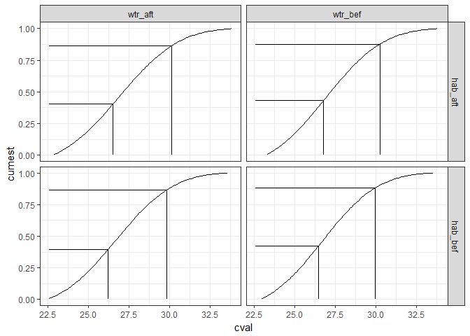
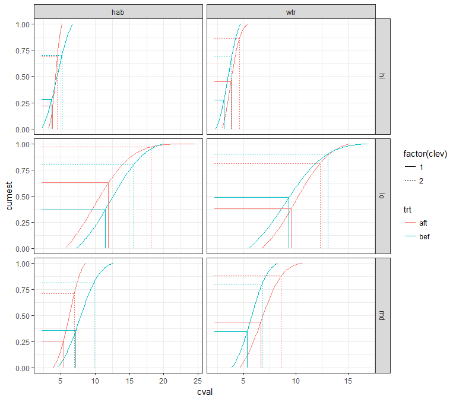

# Exploratory plots of restoration activities in TB


```r
library(tidyverse)
library(readxl)
library(ggmap)
library(lubridate)
library(geosphere)
library(stringi)
library(tibble)
knitr::knit('tbrest.Rmd', tangle = TRUE)
file.copy('tbrest.R', 'R/tbrest.R', overwrite = TRUE)
file.remove('tbrest.R')

# source R files
source('R/get_chg.R')
source('R/get_clo.R')
source('R/get_cdt.R')
source('R/get_brk.R')
```

## Restoration and water quality data


```r
data(restdat)
data(reststat)
data(wqdat)
data(wqstat)
```

Habitat restoration projects:

```r
head(restdat)
```

```
## # A tibble: 6 x 6
##    date                   tech                type   top  acre    id
##   <dbl>                  <chr>               <chr> <chr> <chr> <chr>
## 1  2005 HYDROLOGIC_RESTORATION HABITAT_ENHANCEMENT   hab  12.8  3F3S
## 2  2004         EXOTIC_CONTROL HABITAT_ENHANCEMENT   hab 123.9  6COa
## 3  2005         EXOTIC_CONTROL HABITAT_ENHANCEMENT   hab 123.9  F6iK
## 4  2006 HYDROLOGIC_RESTORATION HABITAT_ENHANCEMENT   hab    45  YqTO
## 5  2000         EXOTIC_CONTROL HABITAT_ENHANCEMENT   hab  0.25  OSr2
## 6  1989 HYDROLOGIC_RESTORATION HABITAT_ENHANCEMENT   hab    50  dLmu
```
Locations of habitat restoration projects:

```r
head(reststat)
```

```
## # A tibble: 6 x 3
##      id      lat       lon
##   <chr>    <dbl>     <dbl>
## 1  3F3S 27.88977 -82.39888
## 2  6COa 27.88994 -82.40340
## 3  F6iK 27.88181 -82.39783
## 4  YqTO 27.97370 -82.71504
## 5  OSr2 27.81921 -82.28548
## 6  dLmu 27.99817 -82.61724
```
Water quality data:

```r
head(wqdat)
```

```
## # A tibble: 6 x 5
##    stat   datetime  chla   sal    do
##   <int>     <date> <dbl> <dbl> <dbl>
## 1    47 1974-01-01    NA  21.1   7.9
## 2    60 1974-01-01    NA  21.3   8.2
## 3    46 1974-01-01     3  17.4   8.3
## 4    64 1974-01-01     2  19.1   8.2
## 5    66 1974-01-01    NA  21.3   8.1
## 6    40 1974-01-01    NA  22.0   8.4
```
Locations of water quality sites:

```r
head(wqstat)
```

```
## # A tibble: 6 x 3
##    stat      lon     lat
##   <int>    <dbl>   <dbl>
## 1    47 -82.6202 27.9726
## 2    60 -82.6316 27.9899
## 3    46 -82.6593 27.9904
## 4    64 -82.6833 27.9794
## 5    66 -82.6397 27.9278
## 6    40 -82.5873 27.9291
```

## Distance to restoration sites {.tabset}


```r
wqmtch <- get_clo(restdat, reststat, wqstat, resgrp = 'top', mtch = 10)
head(wqmtch)
```

```
## # A tibble: 6 x 5
##    stat resgrp   rnk    id     dist
##   <int>  <chr> <int> <chr>    <dbl>
## 1    47    hab     1  dLmu 2861.746
## 2    47    hab     2  DyAP 2971.000
## 3    47    hab     3  P2gv 4526.348
## 4    47    hab     4  Wxg6 4526.348
## 5    47    hab     5  ruky 4526.348
## 6    47    hab     6  cTzf 4526.348
```

### Closest 

```r
## 
# plots

# combine lat/lon for the plot
toplo <- wqmtch %>% 
  left_join(wqstat, by = 'stat') %>% 
  left_join(reststat, by = 'id') %>% 
  rename(
    `Restoration\ngroup` = resgrp,
    `Distance (dd)` = dist
  )
    
# restoration project grouping column
resgrp <- 'top'
restall <- left_join(restdat, reststat, by = 'id')
names(restall)[names(restall) %in% resgrp] <- 'Restoration\ngroup'

# extent
ext <- make_bbox(wqstat$lon, wqstat$lat, f = 0.1)
map <- get_stamenmap(ext, zoom = 12, maptype = "toner-lite")

# base map
pbase <- ggmap(map) +
  theme_bw() +
  theme(
    axis.title.x = element_blank(),
    axis.title.y = element_blank()
  ) +
  geom_point(data = restall, aes(x = lon, y = lat, fill = `Restoration\ngroup`), size = 4, pch = 21) +
  geom_point(data = wqstat, aes(x = lon, y = lat), size = 2)

# closest
toplo1 <- filter(toplo, rnk %in% 1)

pbase + 
  geom_segment(data = toplo1, aes(x = lon.x, y = lat.x, xend = lon.y, yend = lat.y, alpha = -`Distance (dd)`, linetype = `Restoration\ngroup`), size = 1)
```

<!-- -->

### Closest five

```r
# closest five
toplo2 <- filter(toplo, rnk %in% c(1:5))

pbase + 
  geom_segment(data = toplo2, aes(x = lon.x, y = lat.x, xend = lon.y, yend = lat.y, alpha = -`Distance (dd)`, linetype = `Restoration\ngroup`), size = 1)
```

<!-- -->

### Closest ten

```r
# closest twenty
toplo3 <- filter(toplo, rnk %in% c(1:10))

pbase + 
  geom_segment(data = toplo3, aes(x = lon.x, y = lat.x, xend = lon.y, yend = lat.y, alpha = -`Distance (dd)`, linetype = `Restoration\ngroup`), size = 1)
```

<!-- -->

## Summarizing effects of restoration projects

Get weighted average of project type, treatment (before, after) of salinity for all wq station, restoration site combinations.

```r
salchg <- get_chg(wqdat, wqmtch, statdat, restdat, wqvar = 'sal', yrdf = 5)
head(salchg)
```

```
## # A tibble: 6 x 4
## # Groups:   stat, resgrp [3]
##    stat resgrp   trt     cval
##   <int>  <chr> <chr>    <dbl>
## 1     6    hab   aft 24.67069
## 2     6    hab   bef 24.90016
## 3     6    wtr   aft 25.27052
## 4     6    wtr   bef 24.92134
## 5     7    hab   aft 25.92751
## 6     7    hab   bef 25.25877
```

Get conditional probability distributions for the restoration type, treatment effects, **salinity** as first child node in network. 

```r
wqcdt <- get_cdt(salchg, 'resgrp', 'trt')
head(wqcdt)
```

```
## # A tibble: 4 x 5
##   resgrp   trt              data       crv                    prd
##    <chr> <chr>            <list>    <list>                 <list>
## 1    hab   aft <tibble [45 x 2]> <dbl [2]> <data.frame [100 x 3]>
## 2    hab   bef <tibble [45 x 2]> <dbl [2]> <data.frame [100 x 3]>
## 3    wtr   aft <tibble [45 x 2]> <dbl [2]> <data.frame [100 x 3]>
## 4    wtr   bef <tibble [45 x 2]> <dbl [2]> <data.frame [100 x 3]>
```

Discretization of salinity conditional probability distributions: 

```r
salbrk <- get_brk(wqcdt, qts = c(0.33, 0.66), 'resgrp', 'trt')
salbrk
```

```
## # A tibble: 8 x 5
##   resgrp   trt      qts       brk  clev
##    <chr> <chr>    <dbl>     <dbl> <dbl>
## 1    hab   aft 26.81396 0.4266360     1
## 2    hab   aft 30.39395 0.8715857     2
## 3    hab   bef 25.60765 0.3508532     1
## 4    hab   bef 29.59290 0.8606345     2
## 5    wtr   aft 26.17562 0.3782141     1
## 6    wtr   aft 29.88913 0.8543255     2
## 7    wtr   bef 26.64680 0.4313636     1
## 8    wtr   bef 30.00577 0.8841462     2
```

A plot showing the breaks:

```r
toplo <- select(wqcdt, -data, -crv) %>% 
  unnest
ggplot(toplo, aes(x = cval, y = cumest, group = trt)) + 
  geom_line(aes(colour = trt)) + 
  geom_segment(data = salbrk, aes(x = qts, y = 0, xend = qts, yend = brk, linetype = factor(clev), colour = trt)) +
  geom_segment(data = salbrk, aes(x = min(toplo$cval), y = brk, xend = qts, yend = brk, linetype = factor(clev), colour = trt)) +
  facet_grid(~ resgrp) +
  theme_bw()
```

<!-- -->

Get conditional probability distributions for the restoration type, treatment effects, salinity levels, **chlorophyll** as second child node in network. 

```r
# get chlorophyll changes
chlchg <- get_chg(wqdat, wqmtch, statdat, restdat, wqvar = 'chla', yrdf = 5)
  
# merge with salinity, bet salinity levels
salbrk <- salbrk %>% 
  group_by(resgrp, trt) %>% 
  nest(.key = 'levs')
allchg <- full_join(chlchg, salchg, by = c('resgrp', 'trt', 'stat')) %>% 
  rename(
    salev = cval.y, 
    cval = cval.x
  ) %>% 
  group_by(resgrp, trt) %>% 
  nest %>% 
  left_join(salbrk, by = c('resgrp', 'trt')) %>% 
  mutate(
    sallev = pmap(list(data, levs), function(data, levs){

      out <- data %>% 
        mutate(
          salev = cut(salev, breaks = c(-Inf, levs$qts, Inf), labels = c('lo', 'md', 'hi')),
          salev = as.character(salev)
        )
      
      return(out)
      
    })
  ) %>% 
  select(-data, -levs) %>% 
  unnest
  
chlcdt <- get_cdt(allchg, 'resgrp', 'trt', 'salev')
chlbrk <- get_brk(chlcdt, c(0.33, 0.66), 'resgrp', 'trt', 'salev')
chlbrk %>% 
  print(n = nrow(.))
```

```
## # A tibble: 24 x 6
##    resgrp   trt salev       qts       brk  clev
##     <chr> <chr> <chr>     <dbl>     <dbl> <dbl>
##  1    hab   aft    lo 11.978108 0.6287199     1
##  2    hab   aft    lo 18.156823 0.9700651     2
##  3    hab   aft    md  5.436842 0.2586564     1
##  4    hab   aft    md  6.995905 0.7121838     2
##  5    hab   aft    hi  3.862818 0.2220339     1
##  6    hab   aft    hi  4.532562 0.6880934     2
##  7    hab   bef    lo 11.501613 0.3697316     1
##  8    hab   bef    lo 15.662426 0.8031924     2
##  9    hab   bef    md  7.215963 0.3589801     1
## 10    hab   bef    md  9.861630 0.8147549     2
## 11    hab   bef    hi  3.731300 0.2833282     1
## 12    hab   bef    hi  5.215827 0.7037234     2
## 13    wtr   aft    lo  9.569390 0.3799029     1
## 14    wtr   aft    lo 12.348305 0.8135417     2
## 15    wtr   aft    md  6.648959 0.4379281     1
## 16    wtr   aft    md  8.616993 0.8786580     2
## 17    wtr   aft    hi  3.809958 0.4514589     1
## 18    wtr   aft    hi  4.611583 0.8642126     2
## 19    wtr   bef    lo  9.345197 0.4895243     1
## 20    wtr   bef    lo 13.075621 0.9010680     2
## 21    wtr   bef    md  5.349960 0.3472494     1
## 22    wtr   bef    md  6.788045 0.8020576     2
## 23    wtr   bef    hi  3.136750 0.2781608     1
## 24    wtr   bef    hi  3.898500 0.6980949     2
```

A plot showing the breaks:

```r
toplo <- select(chlcdt, -data, -crv) %>% 
  unnest
ggplot(toplo, aes(x = cval, y = cumest, group = trt)) + 
  geom_line(aes(colour = trt)) + 
  geom_segment(data = chlbrk, aes(x = qts, y = 0, xend = qts, yend = brk, linetype = factor(clev), colour = trt)) +
  geom_segment(data = chlbrk, aes(x = min(toplo$cval), y = brk, xend = qts, yend = brk, linetype = factor(clev), colour = trt)) +
  facet_grid(salev ~ resgrp, scales = 'free_x') +
  theme_bw()
```

<!-- -->


